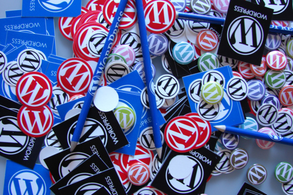

export const metadata = {
  title: "Stage Three",
  date: "2012-01-15T20:41:46-05:00",
};

I've designed the new Pipe Dream website in Photoshop and coded (most of it, at least) into a HTML/CSS layout that is [responsive](/blog/bupipedream-on-ipad/), uses a [flexible grid](/blog/less-css-grid/), and takes advantage of the latest frameworks and tools and such as the [HTML5 Boilerplate](http://html5boilerplate.com/) and [LESS](http://lesscss.org/).

Stage three is the creation of a WordPress theme and should be considerably more difficult. A lot has changed since I last developed for WordPress, so it's time to [read the manual](http://codex.wordpress.org/).

Throughout the next few weeks I'll be posting about the challenges I encounter and I'll be sharing some code along the way. I'd love to hear from anyone that has, or is, making the move from CollegePublisher to WordPress!

_Photo by [Huasonic](http://www.flickr.com/photos/huasonic/3008912290/)._
