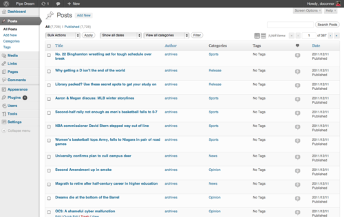

export const metadata = {
  title: "Success!",
  date: "2012-01-23T14:07:35-05:00",
};

It took a while, but I finally got all of the articles into WordPress! Authors, their position, College Publisher `article_id`'s, and post images are all saved as metadata in the `wp_postmeta` table. I'm eventually gonna write a detailed post to explaining how to move the College Publisher archives into WordPress, so [follow me on Twitter](https://twitter.com/_danoc) for updates!
