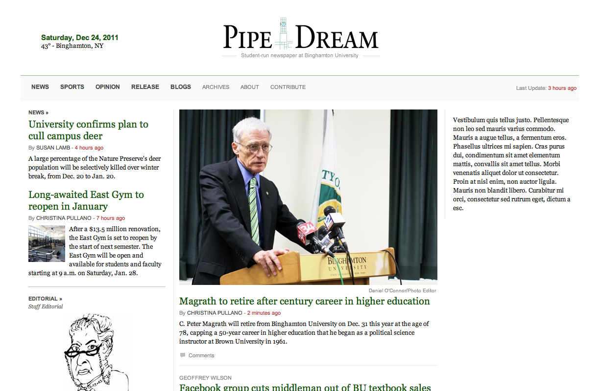

export const metadata = {
  title: "Moving Pipe Dream from College Publisher to WordPress",
  date: "2012-03-04T02:01:00-05:00",
};

It's been three weeks since I launched the [new Pipe Dream website](http://bupipedream.com/). The former website, powered by College Publisher, has given way to a new website built on WordPress. This is how I did it.

### Creating the Design


The design was inspired by [The New York Times](http://www.nytimes.com/)'s layout, the clean (and responsive design) at [The Boston Globe](http://bostonglobe.com/), and the legibility of [Niemam Lab](http://www.niemanlab.org/).

I began working on a mockup during the 2012 ACP Conference in Orlando, Florida after committing to step down as Photo Editor at the end of the semester. Schoolwork forced me to leave the design unfinished, but I got back to work when the fall semester ended.

### Ideas

I wrote at length about my [plans for the new website](https://danoc.me/blog/plans-for-bupipedream/). While many of the ideas are still in progress, I've implemented my favorite idea: a responsive design. Responsive designs "respond" to the browser width so that the website looks as great on an iPhone as it does on an iMac.

### From PSD to HTML



With a basic mockup completed, I began coding. I used the [HTML5 Boilerplate](http://html5boilerplate.com/) as a starting point and used [LESS](http://lesscss.org) to keep my CSS as neat as possible. The HTML5 Boilerplate provides a set of best-practices and LESS extends CSS to allows neat features such as variables and mixins. I couldn't find a 24-column fluid grid to fit my needs, [so I created my own](https://danoc.me/blog/less-css-grid/).

I developed locally using [MAMP](http://www.mamp.info/) and initially focused on the structure and layout to create the responsive design. [A List Apart](http://www.alistapart.com/articles/responsive-web-design/) and [Smashing Magazine](http://coding.smashingmagazine.com/2011/01/12/guidelines-for-responsive-web-design/) have great guides explaining responsive designs. Personally, I recommend installing the popular Web Developer extension ([Firefox](https://addons.mozilla.org/en-US/firefox/addon/web-developer/), [Chrome](https://chrome.google.com/webstore/detail/bfbameneiokkgbdmiekhjnmfkcnldhhm)) to measure the your browser width. Doing so allows you to make changes to your CSS as the layout begins to break. In total, the Pipe Dream layout adjusts 15 times when scaled from desktop to mobile.

I eventually added styles to the website and made the .html file it look more like its .psd counterpart. I created index.html, single.html, and author.html files before moving on to WordPress development. I probably should have spent more time perfecting the static files, but I was restless and wanted to bring the website to life.

### Cleaning the Archives


It took some time, but College Publisher eventually emailed us a link to download our archives. The archives were split into two parts: a 100mb .zip file of images and [a 30mb .txt file](https://danoc.me/blog/database-dump/) with _(hopefully!)_ every Pipe Dream article dating back to 2005.

As with all things College Publisher, cleaning the archives was a pain. In fact, it was the worst part of the whole experience. I renamed the .txt file to a .csv and opened it in Excel, Open Office, and just about any program that could handle a file that large. The file was poorly formatted, starting with a line break and ending mid-way through an article. College Publisher also decided to use `≤|||≤` as a delimiter, requiring me to initially use Open Office. Even then, it took days to remove the empty columns and clean up years of poorly formatted code.

Almost all of this was manually done in Open Office. I learned a bit about regular expressions and used OO's powerful find and replace function to remove empty paragraphs, random line breaks, and even a Javascript redirect hidden within an article.

[As Brian Schlansky, former Web Editor at The Miami Hurricane, suggested](http://www.greglinch.com/2008/09/how-we-did-it-moving-the-miami-hurricane-from-college-publisher-to-wordpress.html), I reorganized the spreadsheet to mimic the WordPress database structure. This involved creating new columns, renaming others, and moving some columns (such as image info and College Publisher IDs) to a separate sheet.

I tried importing the .ods (Open Document Spreadsheet) file to a local MySQL table using phpMyAdmin, but it failed every time. Eventually I realized that the file was too large. I split the 30mb file into 36 parts, importing no more than 250 rows at once. _It did the trick._

From then on, I worked in phpMyAdmin and wrote short PHP scripts to make changes to the database.

### The WordPress Database

I didn't use special tools or plugins to import the posts into WordPress. Instead, I simply mimicked [WordPress's database structure](http://codex.wordpress.org/Database_Description). I began with the `wp_posts` table and worked my way to the `wp_postmeta` table. Each row in `wp_postmeta` has an automatically generated `meta_id`, a `post_id` it is associated to, a `meta_key`, and a `meta_value`. These are extremely useful when importing the archive.

#### Authors

Because it would be inefficient to create 500+ authors (especially since many only wrote one or two articles), I stored the author name and position in meta fields named `_author` and `_author_position`. (The underscores tell WordPress not to display the meta key when as a field when creating new posts). Each post in `wp_posts` is initially assigned to a WordPress user named archives.

#### Images

Although new images are stored as post attachments, I decided to save the archived images in `wp_postmeta`. I chose `_image1` as the meta key and kept the value that College Publisher provided. Each value is a string with an id, filename, caption, and photo credit.

#### College Publisher ID

Since I wanted to minimize the damage to search engine rankings _(plus, who wants a bunch of 404s?)_, I stored the College Publisher IDs in `wp_postmeta`. I also saved the article IDs that pre-dated our College Publisher website.

Those meta fields are retrieved whenever a page returns a 404 and needs to be redirected.

#### Categories

I created a few categories (news, opinion, sports, and release) in WordPress and checked the `wp_terms` table to view their IDs. I then wrote a PHP script to create a new row in `wp_term_relationships` for each post. The field `object_id` refers to the post ID and `term_taxonomy_id` refers to the category ID. In this case, `term_order` can be set to '0'. Posts that did not have a category were assigned to a category named archive.

Be careful to ensure that each post is assigned a category. This will help avoid issues when creating author pages.

#### Post Name

The `post_name` field in `wp_posts` refers to the post-slug and is used to display post titles in the URL. I wrote a short PHP script to generate the `post_name`, but later ran into problems with periods in the URLs. Be sure to separate words with a dash and remove any punctuation to avoid such errors.

#### Timestamps

The `wp_posts` table contains four fields that store time. Once again, I wrote a PHP script to convert the College Publisher date string into the datetime format required by WordPress. The format is `YYYY-MM-DD HH:MM:SS`. Since College Publisher only provides the post's date, I set the time to 00:00:00.

#### Comments

Our College Publisher website used [DISQUS](http://disqus.com/) to manage our comments, I used their tool to migrate the comments. All I had to do was ensure that the old URLs redirect properly.

### Developing a WordPress Theme

WordPress is incredibly flexible and can be extended to do just about anything. When developing the Pipe Dream theme, I tried to rely on as few plugins as possible. Instead, I wrote (and borrowed) many custom functions to preform various tasks.

I designed and developed Pipe Dream's WordPress theme from scratch. Developers that don't have experience with WordPress may want to customize an existing theme or spend some time studying the [WordPress Codex](http://codex.wordpress.org/).

These are a few obstacles of the I encountered along the way:

#### Handling Photos

Photos should be attached to posts and retrieved using a custom function. The Bangor Daily News wrote a great blog post explaining [how they manage their photos in WordPress](http://dev.bangordailynews.com/2011/09/29/media-management-in-wordpress/).

I used a custom WordPress function to [add a photo credit field to attachments](http://wordpress.org/support/topic/addcustomize-meta-fields-to-edit-media-attachment-screen#post-2304586). Attachments are stored in the `wp_posts` table and custom fields are stored in the `wp_postmeta` table.

Since each photo will appear in various sizes and locations, I used the [`add_image_size` function](http://codex.wordpress.org/Function_Reference/add_image_size) to define custom sizes.

The Pipe Dream website also uses the [Regenerate Thumbnails plugin](http://wordpress.org/extend/plugins/regenerate-thumbnails/) to resize photos when a new size is added.

#### Article Layout


Inspired by the layouts of The New York Times and The Boston Globe, I designed the Pipe Dream website to display photos in different locations depending on photo quality. [This sports article](http://www.bupipedream.com/sports/8562/binghamton-basketball-rebuilding/) is a great example of what the theme can accomplish.

WordPress lets you prioritize your images after uploading. Great horizontal photos are given a priority of '1' and display under the headline. Photos with a priority of '2' are displayed within the article. All other photos are added to a slideshow.

#### Content Zones

The new Pipe Dream website relies on the [Zoninator plugin](http://wordpress.org/extend/plugins/zoninator/) to display articles in the right location. The Pipe Dream homepage is divided into nine "zones." It's important to ensure that the articles chosen for a zone have an appropriate photo attached. For example, the `news-feature` zone will only look good with a horizontal photo.

#### Author Information

If cleaning the College Publisher archives was the worst part, then creating author pages was the second. Since the College Publisher author information was stored as custom fields, each author must get their own manually-created user account. That's a lot of work. It's even more work to attribute their old articles to their newly created account _(they were previously attributed to a user called archives)_.

To link their old articles, I wrote a PHP script that takes a username and grabs the user's ID and full name. It then searches through `wp_postmeta` to find a `meta_value` equal to the user's full name where the `meta_key` is equal to `_author`. If a result is found, it grabs the `post_id` from `wp_postmeta` and sets the `post_author` in `wp_posts` to the user's ID. This script must be run manually for each author that wants a portfolio of their work.

At Pipe Dream, I use [custom user fields](http://wordpress.stackexchange.com/a/4125) to add information such as current position and title. I also implemented [Gravatar](http://gravatar.com/) to handle profile images. For an example, take a look at [the current Editor in Chief's profile](http://www.bupipedream.com/author/nfleming/).

To handle multiple authors, I use the excellent [Co-Authors Plus](http://wordpress.org/extend/plugins/co-authors-plus/).

#### Redirecting old URLs

I use Daniel Bachhuber's [CP Redirect](http://wordpress.org/extend/plugins/cp-redirect/) plugin to redirect College Publisher URLs and modified it to prepend "#1." to the requested ID (as College Publisher did). I also ensure that the pre-College Publisher URLs continue to work.

I've been monitoring Google's [site:bupipedream.com search results](https://www.google.com/search?q=site%3A*.bupipedream.com) and [Google Webmaster Tools](https://www.google.com/webmasters/tools/) to manually redirect some broken links in the .htaccess file.

### Configuring a Server

I'm no expert at server configuration, but I decided to go with [Linode](http://www.linode.com/?r=750de1db04d85db860bc005878521d367bc672f3) as our new host. They provide great service, quick support, and I've used them to host [my personal sites](http://danoc.me/).

Linode provide a Virtual Private Sever (VPS), which gives users complete control over their server. That also means that users are responsible for configuring and installing Linux, Apache, MySQL, and PHP.

A VPS is not necessary by any means, but I figured it would be a good learning experience. Our plan costs \$19.95 a month and provides 512MB of RAM, 20GB of storage, and 200GB of data transfer/month.

### Launching the new Pipe Dream

After a few cancelled launch attempts, 100+ hours of work, and my first all- nighter in college, the new Pipe Dream website launched on Friday, February 10. The launch was far from smooth, however, since I've spent the last three weeks fixing bugs and adding features that should have existed from the start.

Pushing the website online was fairly easy. I installed WordPress on the server, exported the local WordPress install (using WordPress's built-in export feature), and imported it to the server's WordPress install. Since the file was so large, I had to modify the maximum file size allowed in the php.ini file. If you run into errors and don't have access to your host's PHP configuration, you can manually split the export into multiple files. I then uploaded the Pipe Dream theme and spent a few hours fixing bugs.

### Developing Locally

It's terrible practice to develop on the production website, so I use FileZilla to download all of latest files before developing locally. I also use phpMyAdmin to export the WordPress table from bupipedream.com and import it to my local database. I then run a quick SQL query to fix the URL change:

```sql
UPDATE `wordpress`.`wp_options` SET `option_value` = 'http://localhost:8888/bupipedream/' WHERE `wp_options`.`option_id` = 3;
UPDATE `wordpress`.`wp_options` SET `option_value` = 'http://localhost:8888/bupipedream/' WHERE `wp_options`.`option_id` = 39;
```

Of course, you may need to change the `option_id` value to fit your needs.

When I'm ready to commit my changes, I upload the modified theme files to the production server.

### On my to-do List

The new website is still far from complete. In the future, I plan to clean up and share some of the code, improve performance _(maybe use a CDN?)_, use version control, use the HTML5 Boilerplate build script, improve the deployment process, fix more bugs, and add new features.

Most importantly, however, I hope to build a staff of talented web developers that want to make Pipe Dream the best college newspaper website.

### Many thanks to…

Thanks to websites such as [The Bangor Daily News](http://bangordailynews.com/) and [The Daily Cougar](http://thedailycougar.com/) for showing that it is possible to run a successful news website on WordPress.

Thanks to the WordPress community and all those that contribute to the open-source projects that power Pipe Dream.

And a **HUGE** thanks to the work done by Daniel Bachhuber, William P. Davis, and others formerly involved with [CoPress](http://www.copress.org/blog/). Hopefully this post will help other papers do the same.
