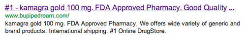

export const metadata = {
  title: 'Battling the infamous WordPress "Pharma" hack',
  date: "2012-10-28T01:31:57-04:00",
};

I got a Facebook message a few days ago from the Editor in Chief asking if the Pipe Dream was hacked. The attached screenshot showed ads for _cialis_ and _viagra_ instead of a popular Greek Life article. Neither of us were able to reproduce the issue, so I ignored it and went to bed.



The hack became clear the next day as a Google search for Pipe Dream returned results titled _"#1 - kamagra gold 100 mg. FDA Approved Pharmacy. Good Quality …"_. Fetching bupipedream.com as a Googlebot through Google Webmaster tools indicated that the hack targeted spiders and bots.

Some more searching led me to a great article explaining the [infamous WordPress "Pharma" hack](http://blog.sucuri.net/2010/07/understanding-and-cleaning-the-pharma-hack-on-wordpress.html).

I followed the advice online and ran the following command:

```bash
grep -r "base64_decode" .
```

The results returned a suspicious file named `uploas.php` in the `wp-includes` directory. A [quick glance at the file](http://p.linode.com/7148) raised many red flags. I deleted the infected file and grep'd for the file name. The search returned a reference to `uploas.php` in `wp-blog-header.php`, so I deleted the infected line.

I'm still trying to find what caused the hack, but I've taken some of the precautions outlined in the "[Hardening WordPress](http://codex.wordpress.org/Hardening_WordPress)" tutorial. I noticed that the attack also deleted the WP Super Cache plugin, so I've alerted the developer.

While the website is back to normal, I'm keeping an eye out for any followup attacks. Have you experienced the same issue? Let me know!
