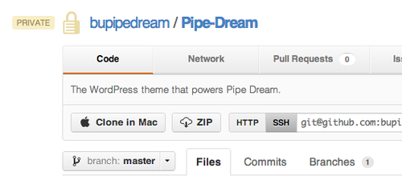

export const metadata = {
  title: "Moved to GitHub",
  date: "2012-12-13T21:55:01-05:00",
};

Thanks to [GitHub's generous educational discount](https://github.com/edu), I've moved the Pipe Dream repository to GitHub. Until now we [hosted the private repository on our Linode VPS](https://danoc.me/blog/pipe-dream-server/), but GitHub offers great user management, a nice user interface, a built-in wiki, and a fantastic issue tracker.

The [transition was smooth](http://kovshenin.com/2011/transfer-your-existing-git-repository-to-github/) and took minutes. And after a little bit of fiddling with Capistrano's config file, deployment is now working better than ever!

GitHub offers [free private repositories to students and student groups](https://github.com/edu). Sign up if you haven't already!
