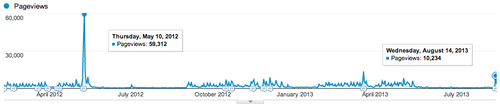

export const metadata = {
  title: "Obama to visit Binghamton University",
  date: "2013-08-17T13:57:33-04:00",
};

Thursday's news of Obama's visit to Binghamton brought tons of traffic to the Pipe Dream site, but only a fraction of the traffic that the "[Four Noble Truths of Binghamton](http://www.bupipedream.com/opinion/10245/binghamtons-noble-truths-lived/)" got.

Unfortunately I'll still be at Optimizely when the President is visiting, but I'm looking forward to use the visit as an opportunity to test out [Beatstrap](http://beatstrap.me/), my latest side-project!
