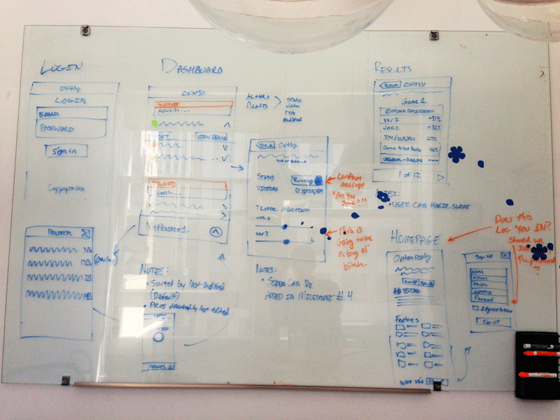

I was fortunate to be one of two interns at Optimizely this summer, working as a front-end developer in their San Francisco office.

It’s a college student’s dream to intern at a company that gives them meaningful projects. During my three months at Optimizely, I implemented a redesign of this blog, [created an events page](http://optimizely.com/events), and developed the [AB Testing Book website](http://abtestingbook.com/). These “small” projects were in addition to my main summer project: creating a mobile version of the Optimizely website.

As the mobile dashboard launches ([read the launch post here](https://blog.optimizely.com/2013/11/14/mobile-ab-testing-announcement/)), I want to share the design and development challenges we faced.

Our mobile dashboard project, code-named Tempo, had a few requirements: it had to be lightweight, quick, and efficient – much like the running workout it was named after. ([As an avid runner](http://www.strava.com/athletes/1907366), the name was only fitting). We also decided that Tempo would be a tool for customers to view test results and start/stop/pause experiments.

With the basic requirements and scope set, a few challenges surfaced.

## Our first challenge was deciding on whether or not to use responsive design.

I’m a huge advocate for responsive design, but it would be impractical to make the existing visual editor and data-heavy results pages responsive on small screens. The alternative was to fork, or split, the codebase into mobile and desktop components. We all agreed that forking the codebase was the right choice.

This decision gave us the chance to start from scratch, rewriting much of the JavaScript and CSS to optimize for performance and use best practices. The downside, of course, is that the codebase becomes harder to maintain. We were able to minimize this problem by sharing code with the desktop site and using the same API endpoints to fetch data from the backend.

## Our second challenge was the framework.

I spent a few days testing out various mobile frameworks and and built basic prototypes using Ratchet, Lungo, and jQuery Mobile. We came to the conclusion that most mobile frameworks are either too bloated or don’t provide enough functionality. So, we decided to skip the mobile frameworks and start from scratch since the project wireframes seemed simple. It turned out to be the right choice. With the exception of the fly-out menu, the HTML and CSS were fairly basic.

## Our third challenge was figuring out how to create the best experience on a mobile screen.

We spent hours sketching flows on the whiteboard to streamline the user experience and make results easily accessible. We faced a few challenges:

- **Minimizing the number of pages to get to results** – We built a slide-out menu that acts as a second dashboard, listing a user’s projects and experiments. This menu lets users jump to any experiment without having to leave the page.
- **Accommodating both power users and regular users** – We ensured that the projects and results are collapsible to make it easier for power users that have many experiments, goals, and variations.
- **Displaying data-heavy results on a small screen** – The desktop site displays results data using charts and large tables. Unfortunately, neither work as nicely on small screens. Ryan, one of our designers, made the goals and variations collapsable and used color to indicate the variation’s status. Multivariate goals are handled by toggling variations.

## Finally, we wanted to make it as fast as possible.

I looked in the Chrome DevTools and noticed that the AJAX calls to the API were one of the biggest bottlenecks. We were able to improve the load times by making a few changes.

For example, it took far too long to load a user’s projects and experiments on the dashboard, so I split the call into two API calls. Instead of loading all of the experiments at once, we load the draft experiments separately. Despite the second AJAX request, it cut the loading time in half.

We also decided to cache JSON from some of our AJAX requests by leveraging the browser’s cache. We set the Cache-Control header to a conservative 10 minutes. Caching JSON isn’t typically recommended because this data changes frequently, but we found this amount of time covers most sessions on Optimizely, while ensuring data won’t be stale in subsequent sessions.

These small changes add up and make a huge impact on performance.

The opportunity to work at a company like Optimizely and on a project like a brand new mobile dashboard is exciting and rare. What sort of interesting projects have you worked on as a web developer intern?
