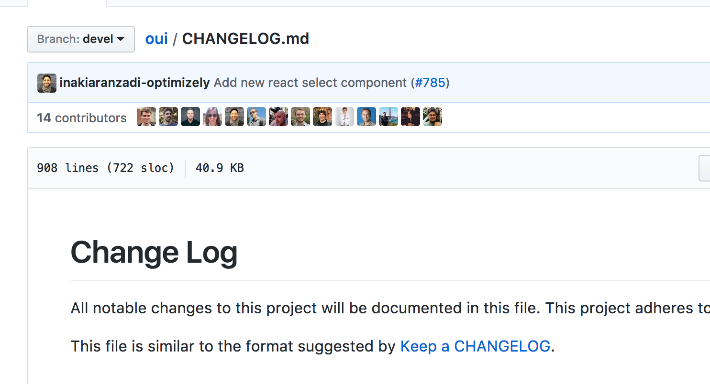

export const metadata = {
  title: "How to version your UI library",
  description:
    "A deep dive into how Optimizely uses Semantic Versioning to release updates to their UI library.",
  date: "2016-05-04T00:00:00Z",
};

I wrote a guide to how we use Semantic Versioning at Optimizely to manage [our UI library](https://github.com/optimizely/oui).

Here's part of the introduction:

> We’ve created an interpretation of the Semantic Versioning rules at Optimizely that both adheres to the scheme, and helps mitigate the risk of incorrectly categorizing changes. Now we have guidelines to confidently and consistently determine the severity of a change that modifies the user interface. The process also introduces a new risk: breaking changes miscategorized and released as non-breaking have the potential to break Sass compilation or introduce UI bugs.

[Read the entire post](https://medium.com/design-optimizely/how-to-version-your-ui-library-1c7a1b7ee23a) on the Design @ Optimizely publication.
