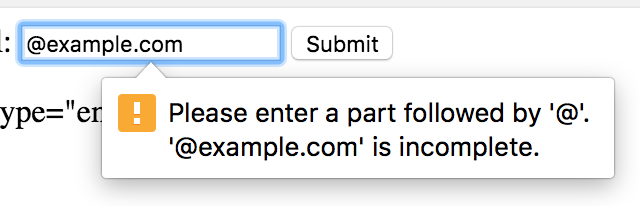
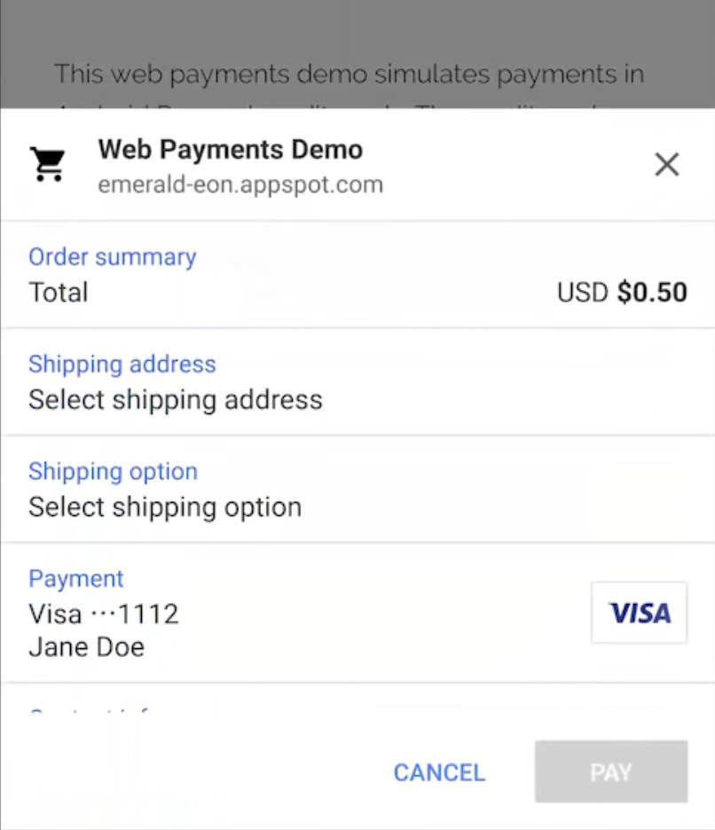
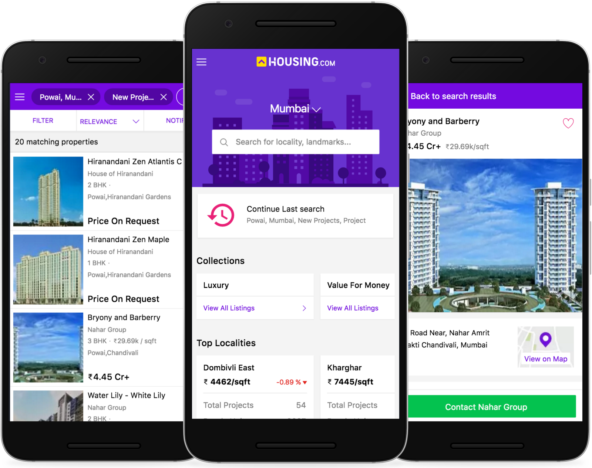
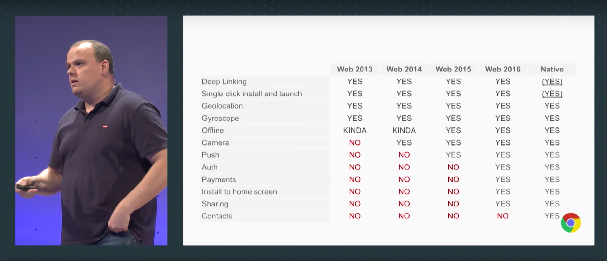

I recently attended the [Chrome Dev Summit](https://developer.chrome.com/devsummit/), a free two-day conference organized by Google in San Francisco. The conference, now in its fourth year, highlights emerging web technologies and APIs that can be used to deliver a great user experience on the web.

I’ve posted raw notes from the conference for the past two years ([2014](https://danoc.me/blog/chrome-dev-summit-2014-notes/), [2015](https://danoc.me/blog/chrome-dev-summit-2015-notes/)), but this time I’d like to highlight a few key themes that the speakers drove home throughout the event.

## Offload payments, sign-in, and other tasks to the browser for increased conversions and streamlined UI

Web standards provide APIs to simplify difficult or repetitive web development tasks. These APIs allow developers to offload responsibilities to the browser which can lead to a smaller, more reliable codebase as well a better end user experience.

Frontend email validation, for example, a basic task that used to involve complicated regular expressions is now trivial thanks to a `type="email"` on `input` tags. The browser also provides UI to notify the user if their email is invalid.

The [autocomplete attribute](https://developers.google.com/web/updates/2015/06/checkout-faster-with-autofill), a not-so-well-known attribute for inputs, helps browsers match input fields to the user profile data it stores for autofilling web forms. This small tweak can lead to large conversion improvements in registration and checkout flows.

Two presentations at the conference took this concept a few steps further.

Sabine Borsay and Eiji Kitamura of Google showed [how to build a seamless cross-device login experience](https://www.youtube.com/watch?v=NJ-sphu2DqQ) using the [Credential Management API](https://developers.google.com/web/updates/2016/04/credential-management-api) while Zach Koch, a PM on Chrome, [spoke about the new Web Payment API](https://www.youtube.com/watch?v=U0LkQijSeko).

The Credential Management API can show a native account chooser when signing in to a website, store credentials locally, auto-signin users if their session has expired, and help users remember which third-party services (Facebook, Google, etc..) they’ve used to sign in.

The [Web Payment API](https://developers.google.com/web/fundamentals/getting-started/primers/payment-request/) lets users pay through a browser UI that works as an "intermediary among merchants, users, and payment methods." Users can get benefits such as shipping address autocomplete and Android Pay integration without any additional work from the developer.

These are just two examples of increasingly deeper integrations between websites and browsers. These integrations provide a consistent user experience across websites and lead to increased conversions.

## Performance testing should be done on average hardware in real-world conditions

[Alex Russell](https://twitter.com/slightlylate), a software engineer on Chrome, told the audience that he carries around a bag of phones that he uses for testing mobile web apps. [He reminded developers](https://www.youtube.com/watch?v=4bZvq3nodf4) that WWW is not the "[Wealthy Western Web](https://www.opera.com/blogs/news/2016/03/www-internet-emerging-markets-bruce-lawson/)" and pleaded with them to test their products on mid-tier devices in less-than-ideal network connections.

Which phone should you choose? [On his blog, he writes](https://infrequently.org/2016/09/what-exactly-makes-something-a-progressive-web-app/):

> The answer is market-dependent. The broader a service’s reach, the lower-end the target phone should be. Networks also differ by market. "3G" often means something wildly different in practice in different geographies and even when users may have access to LTE service in theory, changing network conditions frequently put users into slower connections.

He also lists [a few specific devices](https://infrequently.org/2016/09/what-exactly-makes-something-a-progressive-web-app/). If you can’t test on an actual device, he recommends at least using [webpagetest.org](https://www.webpagetest.org/).

Companies looking to reach a global audience should pay attention. The average phone a consumer buys is increasingly slower and less expensive. Network speeds, even in the US, are also getting slower as carriers struggle to keep up with increased usage.

Tip: You can debug Android devices using the Chrome Dev Tools and [chrome://inspect](https://developers.google.com/web/tools/chrome-devtools/remote-debugging/?hl=en).

## Performance Acronyms: RAIL and PRPL

Last year [Paul Irish spoke about RAIL](https://www.youtube.com/watch?v=w0O2znkSBXA), a [concept created at Google](https://developers.google.com/web/fundamentals/performance/rail) to promote a "user-centric performance model" for the web. The acronym promotes the following best practices:

- **Response**: The web app should respond to user interactions (touch, click, scrolling, etc...) in under 100ms. Any longer and the user will notice a lag. Provide visual feedback if the response takes longer than 500ms.
- **Animation**: Each frame should be rendered in 16ms to achieve 60fps.
- **Idle**: Non-critical work should be deferred to when the device is idle. The work should be broken up into 50ms chunks so that the browser can still respond quickly to user interaction.
- **Load**: The critical content should load in under 1000ms.

This year a few of the talks spoke a new performance acronym: [the PRPL pattern](https://developers.google.com/web/fundamentals/performance/prpl-pattern/). The pattern takes advantage of new web technologies to help deliver mobile experiences more quickly. In more detail:

- **Push**: Use HTTP/2 and HTTP/2 server push to preemptively send the browser resources before it requests it. (HTTP/2 server push should be used with service workers because it will respond with the resource even if the user already has it cached.)
- **Render**: The critical content should render as quickly as possible.
- **Pre-cache**: The server and service worker should pre-cache routes that the user may go to.
- **Lazy-load**: The server should lazy-load requests either from the cache or network when the user changes routes.

## Constraints in emerging markets drives innovation

Flipkart, an Indian e-commerce marketplace, created one of the first [Progressive Web Apps](https://developers.google.com/web/progressive-web-apps/) and [spoke at last year's Chrome Dev Summit](https://www.youtube.com/watch?v=StdKz32M1RM). This year they were one of a handful of companies that were highlighted.

Housing.com, an Indian real estate website, [gave a talk about their new Progressive Web App](https://www.youtube.com/watch?v=KSWSs9UsNpc). They’ve seen a 30% improvement in page load which has lead to a 40% reduction in bounce rates and 38% increase in conversions.

I found these two examples particularly interesting because the innovation and improved user experience was driven by hardware and network constraints as well as an [explosion in the Indian mobile market](http://www.cnbc.com/2016/09/21/how-india-is-shaping-the-global-smartphone-market.html).

Housing.com, for example, places a huge emphasis on performance because their customers are on 2G and 3G connections. They implemented [web push notifications](https://developers.google.com/web/fundamentals/engage-and-retain/push-notifications/) because searching for homes is a long process. They also made their web app work offline because their customers typically buy houses on the outskirts of town where data connections are not reliable or available.

(Also, check out their snazzy [webpack and WebPagetest integration with GitHub](https://medium.com/engineering-housing/continuous-integration-using-webpagetest-and-webpack-1f4465d95405#.vfsen0l2d).)

I’ve recently been exploring how designing and developing websites with a focus on accessibility can lead to higher quality products and unexpected innovations. ([Interesting article about how Microsoft is embracing this way of thinking](https://www.fastcodesign.com/3054927/the-big-idea/microsofts-inspiring-bet-on-a-radical-new-type-of-design-thinking).) These Progressive Web App examples provide a solid parallel to that concept.

## Blurred lines between native apps and mobile web

[Steve Jobs famously said in 2007](https://www.apple.com/pr/library/2007/06/11iPhone-to-Support-Third-Party-Web-2-0-Applications.html) that the iPhone would only support "web 2.0 applications." Apple wisely did a 180 and launched the App Store in 2008.

While native apps are incredibly powerful, the required install step greatly increases the cost to acquire a user. Housing.com, for example, spends $0.07 to acquire a user on their Progressive Web App vs. $3.75 for native apps. (A native app user may be more valuable than a web visitor, but they can reach 53 web visitors per native user so they’re investing heavily in web.)

Google is well aware of the friction that app installs create and has been working on two competing initiatives: Progressive Web Apps and Android Instant Apps.

Apple’s bet on web apps in 2007 may have worked today thanks to powerful new web APIs. These APIs are the heart of **[Progressive Web Apps](https://developers.google.com/web/progressive-web-apps/)** and give web developers closer access to hardware that was once only accessible by native applications. Examples include access to the device’s proximity sensor with [Proximity Events](https://developer.mozilla.org/en-US/docs/Web/API/Proximity_Events), battery information with the [Battery Status API](https://developer.mozilla.org/en-US/docs/Web/API/Battery_Status_API), and notification manager with the [Push API](https://developer.mozilla.org/en-US/docs/Web/API/Push_API).

(Ironically, Apple is hindering mobile web innovation by limiting third-party browsers in iOS and [moving slowly to adopt new web specifications](http://www.businessinsider.com/apple-safari-web-browser-is-becoming-the-new-internet-explorer-2015-7).)

Another team at Google is also working to eliminate the friction of app installs with **[Android Instant Apps](https://www.youtube.com/watch?v=cosqlfqrpFA)**. This experimental technology allows users to run parts of Android apps without installing them.

It’s unclear which of these efforts will stick, but it’s increasingly clear that the lines between mobile web and native will continue to blur as new web standards gain wider adoption and companies seek to reduce the cost to acquire a user.

---

Those are the key themes that I noticed at the Chrome Dev Summit. Here a few more random thoughts and tidbits:

- A commonly referenced number is that consumer mobile app developers can [expect a ](http://blog.gaborcselle.com/2012/10/every-step-costs-you-20-of-users.html)[20% drop in conversions for each step in the funnel](http://blog.gaborcselle.com/2012/10/every-step-costs-you-20-of-users.html).
- "Responsive web development" increasingly refers to mobile-first websites adapting to desktop widths. (I’m a fan of Una Kravet’s recent [blog post about “rethinking responsive”](http://una.im/rethinking-responsive/).)
- I haven’t played with it yet, but [Google’s Lighthouse](https://github.com/GoogleChrome/lighthouse) seems like a neat tool for testing performance. The CLI could be used to integrate with CI environments.
- Checkout forms would be way less painful if developers used the [autocomplete attribute](https://developers.google.com/web/updates/2015/06/checkout-faster-with-autofill) on input fields.
- [MotionMark](http://browserbench.org/MotionMark/) is a neat tool for benchmarking your device.
- Mobile device CPUs are often throttled because they are limited by how much heat the device can dissipate. Alex Russell proved this point by running [MotionMark](http://browserbench.org/MotionMark/) twice on the same phone and getting different scores. The difference? He [strapped an ice pack to the phone](https://youtu.be/4bZvq3nodf4?t=746) the second time around to help the it stay cool.
- There was a lot of talk about not shipping more JavaScript than needed. [Addy Osmani highlighted](https://www.youtube.com/watch?v=e8XejNt5SZo) a few tools to that help keep bundle sizes small:
  - [Preact](https://github.com/developit/preact) is a fast 3kb React alternative.
  - He’s working with webpack to [add performance metrics and budgets](https://github.com/webpack/webpack/issues/3216).
  - [source-map-explorer](https://github.com/danvk/source-map-explorer) is a neat tool to visualize JS in a bundle.
  - [sw-precache-webpack-plugin](https://github.com/goldhand/sw-precache-webpack-plugin) makes it easy to generate service workers with webpack.
- Google and the W3C are aggressively pushing HTTPS by [limiting the new APIs available to insecure websites](https://developers.google.com/web/updates/2016/04/geolocation-on-secure-contexts-only), introducing [design changes to Google Chrome](https://security.googleblog.com/2016/09/moving-towards-more-secure-web.html), and investing in [Let’s Encrypt](https://letsencrypt.org/).
- Polymer initially included complex polyfills to support the [features that make up web components](http://webcomponents.org/). The project becomes less important as custom elements, shadow DOM, and templates receive native browser support. (This is a good thing for the web!)
- The HTML imports API hasn’t gone anywhere since their implementation is blocked by lack of ES6 modules support within browsers. Chrome developers think it’s unlikely that HTML imports will survive in their current form.
- [Paul Irish showed off](https://www.youtube.com/watch?v=HF1luRD4Qmk) some really neat tips and upcoming features in the Dev Tools.

Think I missed something? Leave a comment or [reach out on Twitter](https://twitter.com/_danoc)!

---

Want to implement these concepts at Optimizely? [We’re looking for engineers and engineering managers](http://grnh.se/q6p0dk)!
