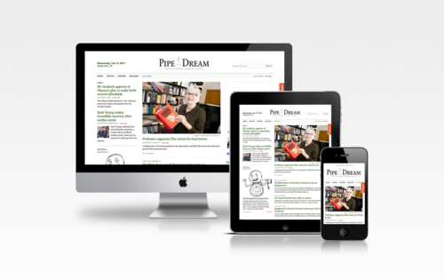

After 100+ hours of work and my first all-nighter in college, the [new Pipe Dream website](http://bupd.me/) launched on Friday, February 10. The new site is powered by WordPress and uses neat tools and services such as the [HTML5 Boilerplate](http://html5boilerplate.com/), [jQuery](http://jquery.com/), [LESS](http://lesscss.org/), and [Get Satisfaction](http://getsatisfaction.com/). This would not have been possible without the contributions of [Daniel Bachhuber](http://danielbachhuber.com/) and [William P. Davis](http://wpdavis.com) (of the [Bangor Daily News](http://dev.bangordailynews.com/)) to the WordPress community.

Although the hardest part is over, I've spent much of the past few days fixing bugs and adding features that had to be cut in order to launch on time.

Once everything settles down, I'll write a few more posts about the move from College Publisher to WordPress. What would you guys like to know about the process? Let me know know in the comments!
