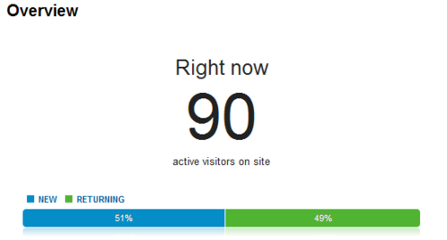

It took 90 active visitors to bring the Pipe Dream site to a screeching halt. The site crashed yesterday afternoon because of a traffic spike to an article announcing that [Passion Pit will headline the 2012 Spring Fling concert](https://www.bupipedream.com/news/9130/passion-pit-to-headline-spring-fling/).

Now it's time to make sure this doesn't happen again. We already use WP Super Cache and minimize our CSS/JS files. Does anyone have any suggestions?
