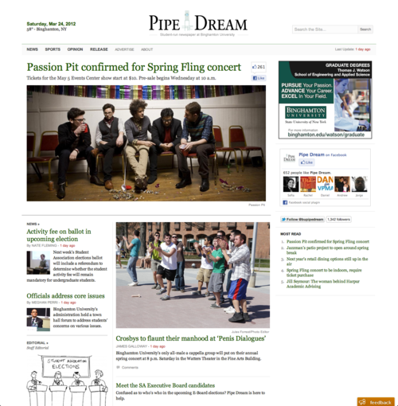

I started working on an alternate home page layout when I heard that we got permission to announce [Passion Pit was booked for Binghamton University's spring fling concert](http://www.bupipedream.com/news/9130/passion-pit-to-headline-spring-fling/).

This layout features a headline and deck above a large photo as well as a Facebook like button encouraging students to share the article. Since [the Pipe Dream redesign](https://danoc.me/blog/from-college-publisher-to-wordpress/), this has been our most shared article on Facebook with 285+ likes. It's hard to determine how many of those are due to the like button, but I think that the layout was a success.
