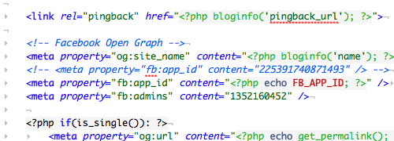
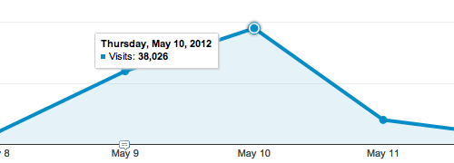

It's been a while since I've posted here, so I'll run through everything I've neglected to write about for the past three months.

### Open Graph

I've spent a lot of time tailoring the content that gets posted to Facebook and Twitter in an attempt to increase Pipe Dream's online presence. Each status updates, links, and photos is hand-crafted to boost engagement. On the development side, I ensured that each article has the proper [Open Graph protocol](http://ogp.me/) `<meta>` tags so every link looks great when posted to Facebook.

When I relaunched Pipe Dream's website in February, I toyed around with the idea of implementing Facebook's Open Graph social reading features. I decided to build it in early-April and had it running within a few days. While it's hard to measure the social reader's success, traffic from Facebook now accounts for over 35% of Pipe Dream's traffic (compared to 19% in early February).

This increase in traffic can also be attributed to Open Graph `<meta>` tags and stronger posts on [Pipe Dream's Facebook page](https://www.facebook.com/BUPipeDream). This is a significant change since it indicates that more students are reading Pipe Dream online than ever before! Hopefully it will reach 50% at the by the end of the year!

### Binghamton's Four Noble Truths

Alyssa Mercante's column, [Binghamton's Four Noble Truths](http://www.bupipedream.com/opinion/10245/binghamtons-noble-truths-lived/), struck a nerve with the Binghamton community and brought record traffic to Pipe Dream's website. The column received 67,000 pageviews, over 900 comments, and nearly 15,000 likes on Facebook. In comparison, this semester's most popular news article only received 1,500 visits.

I'm glad to say the website easily sustained 350+ active visitors. This is, in large part, due to improvements in our Apache and MySQL configurations, WP Super Cache, and Amazon's CloudFront CDN. Earlier this year, [it crashed at 90 active visitors](http://blog.danoc.me/2012/03/24/spring-fling-concert-announcement-takes-down-the-pipe.html).

While my decision to host Pipe Dream on a VPS brought some trouble, it's nice to see the effort pay off! It's unlikely that another article will garner so much controversy and attention, but I learned a lot in the week that Alyssa's article blew up.

### Internship at WePay

I've spent the past month working for [WePay](http://wepay.com), an online payments platform located in Palo Alto. I'm redesigning the interface for managing applications through WePay's API. _I'm loving it!_
