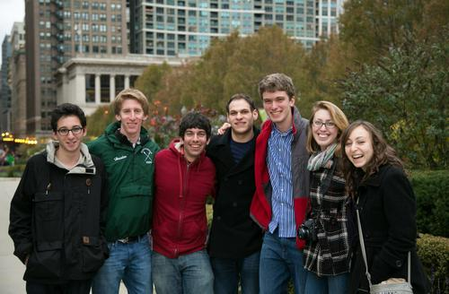
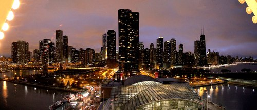

Just got back from Chicago where I, seven Pipe Dream editors, and 2,300 others attended the [ACP/CMA National College Media Convention](http://www.studentpress.org/acp/conventions.html). I loved Chicago and it was a nice break from daily life in Binghamton. I've shared some of [my notes on Google Drive](https://docs.google.com/document/d/1fA66y9JP1wpTjMNRUB_YxRflzApJyBI7XREO4xk8jKo/edit), but here are a few highlights:

- **Fusion Tables** - Chicago-based developer [Derek Eder](http://derekeder.com/) gave a great talk about Google's Fusion Tables and Open Data.
- **Social Media Presence** - The presenters told interviewed professors on campus and created playlists of their top 10 songs using Spotify. They also recommended posting quotes from articles on Pinterest.
- **Website Critique** - The critique went well, but the advisor pointed out that we need to improve the about page, add a commenting policy, and work on making our top articles more prominent by increasing the headline font size.
- **Lunch with Roman** - Grabbed lunch with Roman from [Camayak](http://www.camayak.com/) and bounced around some ideas about a live blogging platform I plan to develop next fall. Cant wait to start working on it!

And the touristy attractions:

- Ate amazing deep dish pizza in the downtown area, incredible Chinese food at Lao Sze Chuan, and great popcorn at Garret's.
- [Had fun at the bean](http://imgur.com/3UkUO) and rode the ferris wheel at the Navy Pier.
- Went for an amazing 10 mile run on the Lakefront Trail.

Chicago was a blast! Unfortunately there were few advanced web development sessions and that's something I hope they change for the next conference. It would be great to have more round-table discussions for web editors to meet and share best practices.

Regardless, I'll _hopefully_ be heading to San Francisco in late February for the mid-winter conference!
