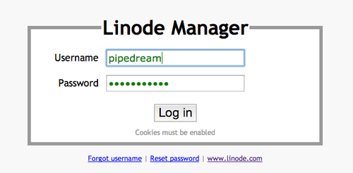
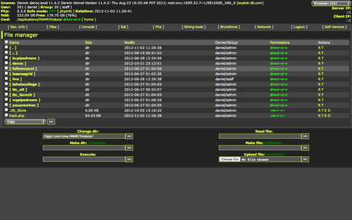
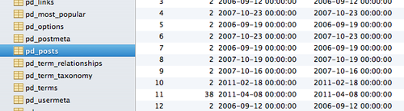

I decided to move the Pipe Dream website to a Linode VPS when we made [the switch from College Publisher to WordPress](http://blog.danoc.me/2012/03/04/from-college-publisher-to-wordpress.html). A VPS offered the flexibility to play around with tools such as Git and would force me to learn a bit about server management. It was a welcome change from the College Publisher days when they hosted the server and required a three month notice to export our data (to a terribly formatted text file).

The move to a VPS caused problems as I [struggled to keep the server online](http://blog.danoc.me/2012/03/24/spring-fling-concert-announcement-takes-down-the-pipe.html). Poor Apache, MySQL, and PHP configurations were the main culprits. I made some changes and, to my surprise, the server barely broke a sweat when [a controversial column went viral](http://blog.danoc.me/2012/07/07/recent-updates.html) and brought record traffic (maxed at 360+ active visitors).

Traffic problems aside, I knew little about user permissions and some mistakes [led to a nasty "Pharma hack"](http://blog.danoc.me/2012/10/28/wordpress-pharma-hack.html) that was only visible to search bots. Some debugging led me to the infected .php files (which I promptly deleted). The hole, however, remained open, so the attacker always returned. I even found a fancy control panel that gave the attacker easy access to the server.

I couldn't take the server offline while classes were in session, so I reconfigured it during Thanksgiving break. Here's how it went:

### Overview

I decided to use Ubuntu 12.04 LTS on a Linode 512 and a installed basic LAMP stack.

### User Accounts

Created a user account for myself and added myself to the sudoers list. I also disabled root access and forced key based authentication for ssh access. Processes such as Apache and MySQL have their own account, as do our two other developers, Will and Cezar. Developers get added to the `www-pub` group and have access to the WordPress core.

### File Structure

Pipe Dream files are stored in `/var/www/bupipedream.com/`. WordPress files are located in the `public_html/` directory, while logs, git files, and database backups are stored in `log`, `git`, and `backup`. Git repositories are stored in `git/repositories/` and files (such as the Pipe Dream theme) are stores in `git/files/` after being deployed with Capistrano. So, the latest Pipe Dream theme, for example, is stored in: `git/files/theme/current/`. A symlink that points to this directory is created in `wp-content/themes/` so that WordPress can access it.

### Permissions

Last time around I added developers to Apache's `www-data` group and _chown'd_ all WordPress files to `www-data:www-data`. As I learned (the hard way), I should have limited Apache's access to only the required directories in `wp- content`. Now, all files and directories are owned by `root:www-pub`, where `www-pub` is the group of developers. Files and directories that Apache should access are owned by `www-data:www-pub`. A lot of this came from a [great answer about Apache permissions](http://serverfault.com/a/65416) on ServerFault.

**Update** (Dec. 13, 2012): WordPress needs access to `wp-content/uploads`, `wp-content/plugins`, and `.htacess` to allow image uploads, automatic plugin downloads, and set mod-rewrite rules. To change the permissions for the uploads folder, for example, run `chown -R www-data:www-pub wp-content/uploads/`

### Database

Instead of configuring phpMyAdmin, I'm using [Sequel Pro](http://www.sequelpro.com/), an open-source MySQL database management tool for Macs. I created a user specifically for WordPress and gave it limited privileges. Each developer has an account with very limited privileges for exporting the database with our [WordPress Site Sync](https://github.com/bupipedream/WordPress-Article-Deck) script.

### Other Notes

* **Log Files** \- Apache and system log files are now monitored and properly rotated using `logrotate`.
* **Passwords** \- Every password is a randomly generated 18 character combination of numbers, letters, and special characters. All WordPress passwords had to be reset as well.
* **Optimizations** \- Linode has some [suggested Apache, MySQL, and PHP configurations](http://library.linode.com/hosting-website) that work well as a starting point.
* **Tools** \- We use `node-less`, a command line compiler for LESS, to compile our LESS files before deployment.

### To-Do

Of course, there's a lot of work to be done. A few things come to mind:

* **Emails** \- We use Google Apps for our primary emails, but the server needs to send outgoing mail. I'm going to try to get [nullmailer](http://untroubled.org/nullmailer/) to work with [Amazon SES](http://aws.amazon.com/ses/).
* **Monitoring** \- I'm going to use monit to monitor the server and send alerts. It can be used to warn of memory issues and ensure that core WordPress files are not touched.

I'd love to hear from other college newspaper's hosting their own websites. Leave a comment or reach out at [daniel@danoc.me](mailto:daniel@danoc.me).
