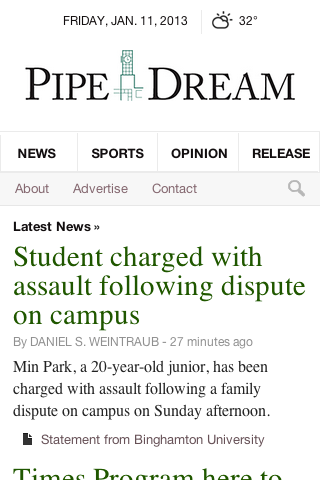

Spent the past day working on an HTML mockup of the [Pipe Dream redesign](http://blog.danoc.me/post/39614524151/pipe-dream-redesign). While the [current design is responsive](http://blog.danoc.me/post/18714910407/from-college-publisher-to-wordpress), I cut corners on the mobile version. The new website is being designed “mobile-first.” In other words, the website is designed for the mobile screen and only enhances as the browser size increases.

Edit: For comparison, take a look at the [old and new version side-by-side](https://www.dropbox.com/s/it4as8mz9kens6l/mobile-comparison.png).
