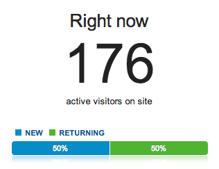

It took active [90 visitors to crash the Pipe Dream server](http://blog.danoc.me/2012/03/24/spring-fling-concert-announcement-takes-down-the-pipe.html) a year ago when we announced that [Passion Pit would headline Spring Fling](http://www.bupipedream.com/news/9130/passion-pit-to-headline-spring-fling/). The article received 374 likes.

Last week we broke the news that Yellowcard will headline the 2013 Spring Fling. The website maxed out at 180 active visitors and we reached 6,900 visits in one day (the largest if you exclude [Alyssa Mercante's viral column](http://www.bupipedream.com/opinion/10245/binghamtons-noble-truths-lived/)). Thankfully, the server didn't break a sweat.

### One year after the redesign

It's been a little over a year since I redesigned the Pipe Dream website. Since Feb. 10, we have received **525,756 visits** and **973,180 pageviews**.

Comparing Feb. 8, 2013 through Mar. 9 2013 to the same period a year ago, **monthly visits increased 34%** (49,113 vs 36,642) and **pageviews increased 24%** (91,059 vs 73,590). We now receive **27% of our visits from mobile devices** compared to 17% a year ago.

More importantly, however, is the audience we are reaching. As a student newspaper, traffic outside the Binghamton area doesn't mean much. To measure student engagement, we can track the percentage of visitors in Binghamton and the percentage of users coming from social media.

**Traffic from Binghamton** is up slightly from 33.63% to 34.98% (10,944 vs 14,966 visits). Additionally, over **25% of our visitors come from Facebook** compared to 19% last year.
