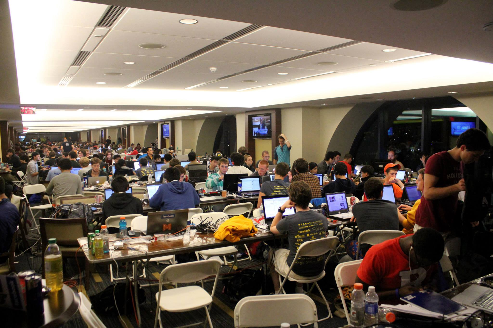
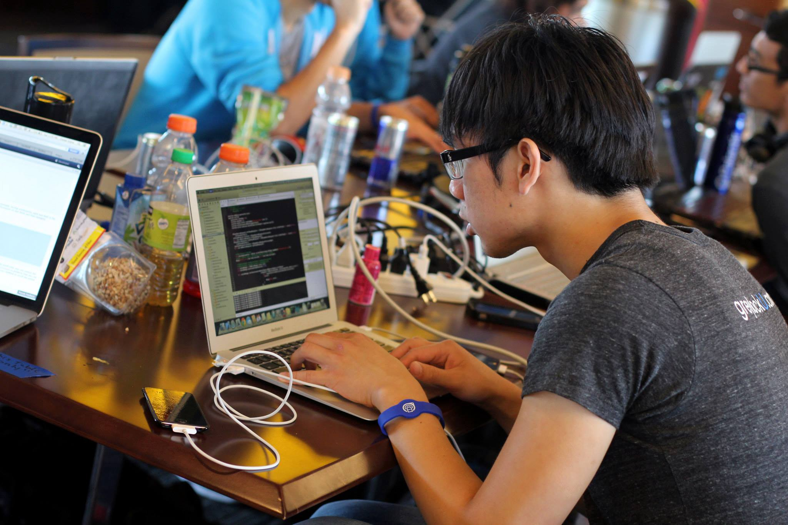
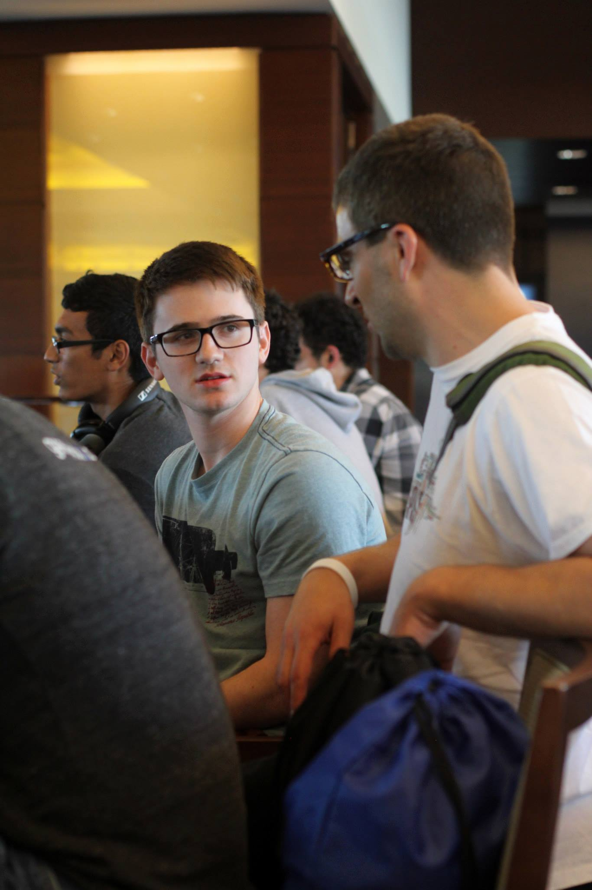
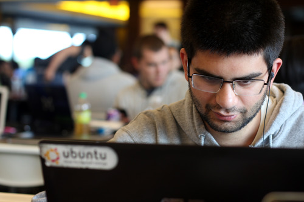
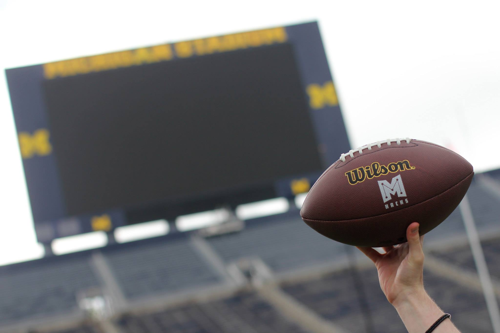
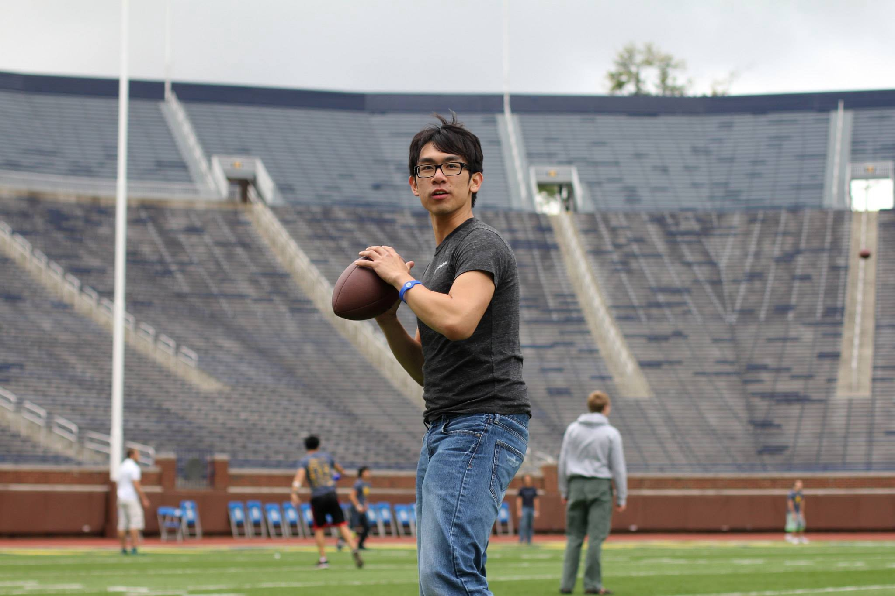
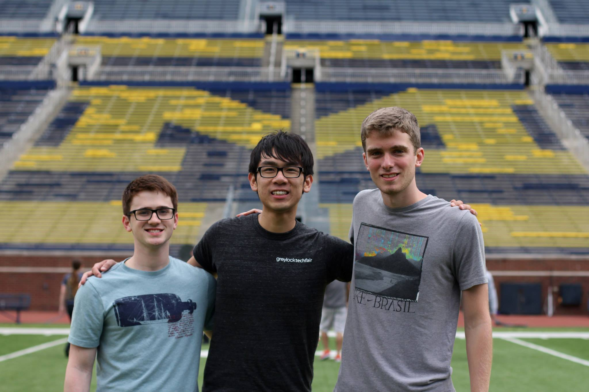
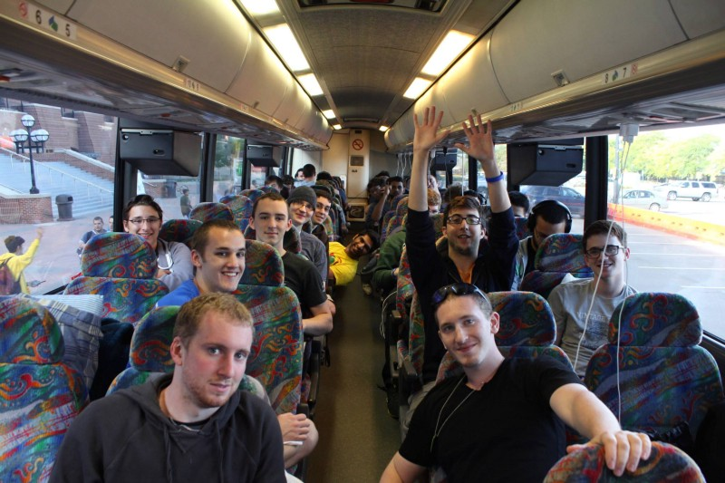

Last spring I read a great blog post titled "[How Michigan took hackathons by storm](https://medium.com/hackers-and-hacking/e6439754078)." I randomly met the author, Dave Fontenot, a few months later in California.

Dave is the co-founder of [MHacks](http://mhacks.org/), the largest student hackathon in the world. He convinced me to rally a team of 20 from Binghamton University to Michigan for last weekend's MHacks.

A few weeks and a 13 hour bus ride later, we made it to The Big House for the Fall 2013 MHacks.

## 36 hours of hacking

We settled in late, formed teams, brainstormed, and hacked for the next 36 hours. Some teams went hard while others were there for the experience.

Most of us took some time to enjoy Ann Arbor, wandering downtown and playing on the field of The Big House when we got the chance.

Three of our teams made it to the Science Fair Expo, presenting their hacks to people that walked by.

The following teams from Binghamton presented:

- **[iGUTYOU](http://mhacks.challengepost.com/submissions/17505-igutyou)** \- Davix and Cezar created an iPhone app that allows us to see how we make decisions when "we're presented with simple questions that we have to answer at a really fast pace." The app gives you two seconds to answer a series of questions in an "attempt to remove user bias."
- **VFD-Alert** \- Yuval and I worked on VFD-Alert, a tool for volunteer fire departments to use SMS instead of pagers. The website uses the Twilio API to send alerts and could eventually be developed to parse responses and send turn-by-turn directions.
- **[Relevant XKCD](http://relevant-xkcd.appspot.com/)** \- Joseph, Gary, Chaoren, and Ajmal created a website called Relevant XKCD that uses the Google Prediction API to "to accurately find relevant XKCD's given key words and phrases or context from a conversation." The hack did well enough to win Google's "Most Creative Prediction API" contest. Each of them won a Nexus 7 tablet.

## What's next for Binghamton

This was Binghamton's first trip to a hackathon—hopefully the first of many. Most fall hackathons are full, but we're planning to attend a few in the spring and start our own.

There isn't a hacker community here at Binghamton, but as Michigan saw, it only takes a few motivated students to start the ripple effect. I'd love to see Binghamton become a force on the West Coast and I'll be working with a few students to make this happen.
