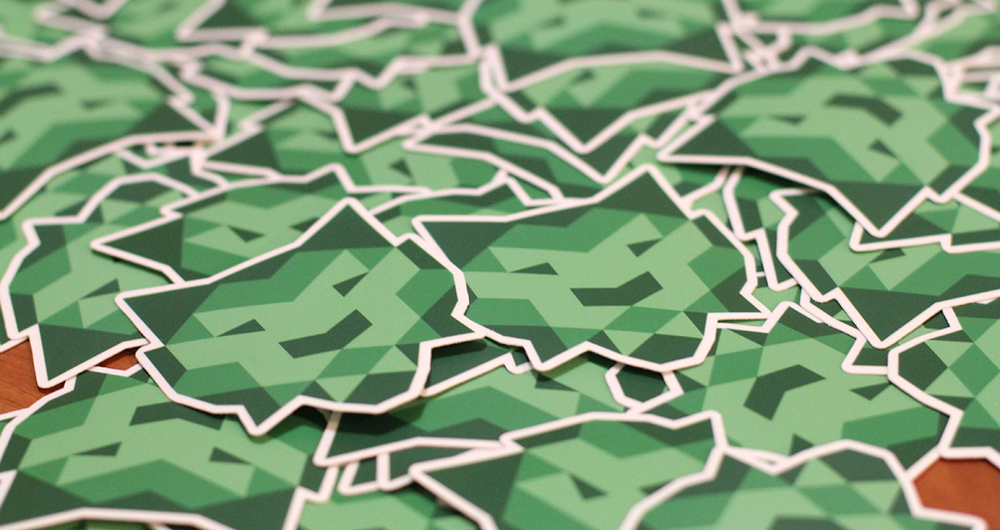

In one semester, we sent 100+ students to hackathons, built a 600-person mailing list, consistently drew 50+ to our weekly workshops, and hosted a 250 person hackathon.

[Here’s how we did it](https://medium.com/@danoc/how-we-built-hackbu-at-binghamton-university-9a637371a476).
