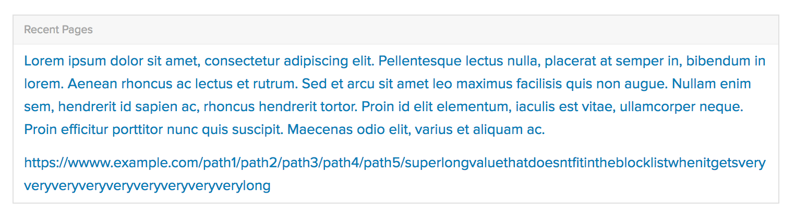
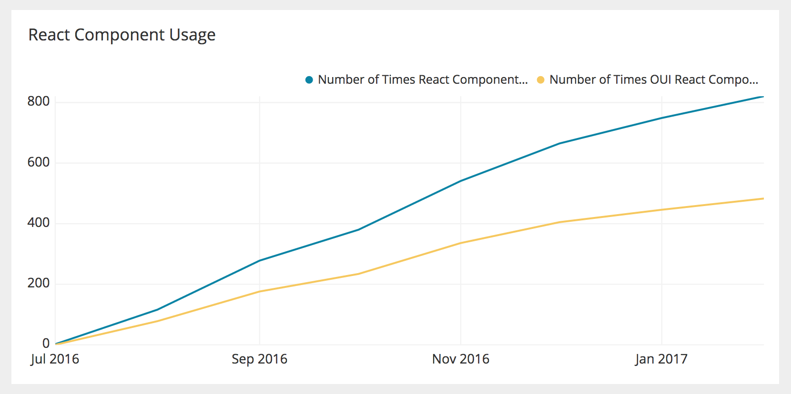

The goal of a UI Engineer at Optimizely is to make it easy to implement high-quality UIs that look and behave consistently. That’s why we’re [on the design team](https://medium.com/design-optimizely/why-we-hire-ui-engineers-on-optimizely-s-design-team-b2a789553b79) and why we spend 20% of our time [paying down design debt](https://medium.com/design-optimizely/pay-down-design-debt-with-polish-day-867eb59dd83d).

The other 80% of our time is spent building out a design system to programmatically encourage design consistency and improve developer productivity.

We strive to prevent design debt from ever reaching our customers and believe that our work is only effective if the easiest way to build a UI is also the highest quality. Design debt that makes it to production should not be seen as the fault of the engineer that implemented it, but rather a sign that our tools failed to meet their needs.

That’s why we build out [React UI components](http://design.optimizely.com/docs/oui/22.5.1/react/), maintain an internal “Quality Checklist,” and [invest heavily in automatically generated documentation](https://github.com/optimizely/oui/issues/686). It’s also why we track our design system’s adoption metrics and ask our engineers to fill out a feedback survey twice a year.

Despite our best efforts, design consistency and developer productivity are at odds when design patterns change and existing components must be updated. Suddenly we’re faced with a difficult choice: move quickly and introduce a one-off tweak, or slow down and implement a scalable solution.

Here at Optimizely, we’ve developed a design system that programmatically promotes consistent and thoughtful design. It encourages collaboration, discourages one-off solutions, and optimizes for long-term productivity.

## The long-term cost of one-off solutions

[OUI](http://github.com/optimizely/oui), Optimizely’s UI library, started off as collection of HTML and CSS components, helper classes, and Bootstrap-esque documentation.

Its powerful helper classes (such as `text--center` and `color--brand`) were widely adopted because they allowed engineers to work quickly without writing CSS. Over time, however, we realized that this ease-of-use encouraged one-off solutions, HTML duplication, and caused long-term maintenance problems.

The “quick wins” that our helper classes enabled also made it nearly impossible to refactor or redesign with confidence and limited the scope of design tasks that myself, and the other UI Engineers, could take on.

### Example: The evolution of our Token component

Let’s explore the evolution of our Token component to better understand the impact of a one-off change.


Optimizely’s Token component was first built in HTML/Sass and the markup uses a mix of `oui-token` classes and OUI’s helper classes. The HTML was duplicated a few times throughout our codebase as the pattern gained traction.

The first implementations of our Token looked like the screenshot above, but, as a product evolves, so do its patterns. We eventually created a Token component that also contains a label.


This addition to our Token was not envisioned when the pattern was created, so we had to write some code to style the text. There are two ways to do this:

1.  **Scalable-ish Solution:** Update the SCSS file to include a new class such as `token__label` that sets the text color to a dark gray. (It’s “scalable-ish” because the HTML is still duplicated.)

2.  **One-off Solution:** Add the additional text to the duplicated markup and wrap it in a `muted` class to change the text color.

The Token, in this particular case, was updated by adding the `muted` class to the text in the duplicated markup. This quick patch makes it incredibly hard to refactor or redesign our Token in the future.

Let’s say we want to darken the Token background to match a product redesign. This seemingly easy change would now take hours. We would have have to remove the recently-added `muted` class, find additional one-off implementations, modify the Token Sass, and visually verify each of the 12 pages that use a Token component. This is especially difficult in a complex product that has dozens of contributors.

This problem has replayed itself time and time again and was limiting the scope of the design improvements that we were feasibly able to make in our product.

We quickly realized that we need to build a system that encourages creating reusable components and discourages the reliance on helper classes. The easiest way to build a UI should also result in the highest quality code.

## Improving design consistency, productivity, and UI quality with React

We started moving Optimizely’s frontend over to React in mid-2016. While the Frontend Engineers were excited about performance improvements, I was excited about adopting a framework that encourages reusability.

Unlike our previous Bootstrap-esque components, engineers using our React components don’t have to think about CSS _or_ HTML. A Token with a close button, for example, looks like this:

```js
import { Token } from "optimizely-oui";

<Token isDismissible={true}>Visit Page: Homepage</Token>;
```

Under the hood, React — with the help of a few other tools — will render the HTML to display a Token. It’s able to do so because [we’ve written the HTML once in OUI](https://github.com/optimizely/oui/blob/77e7394a2d7fc2915eff3dfaacc63e4c8dc9e24f/src/components/Token/index.js), Optimizely’s UI library, and “taught it” how to show a close button.

Passing the previously mentioned label to a Token could be as simple as adding `label="Experience for"` to the Token “element” in the code sample above. Behind the scenes, a UI Engineer would update the one Token JavaScript file to support labels.

We’ve seen both consistency, productivity, and quality improvements from adopting React and creating a library of React UI components:

**Productivity Improvements:** React’s added layer of abstraction (called JSX) provides a familiar syntax that looks like HTML and makes it incredibly easy to use our OUI components. This improves developer productivity and decreases the amount of one-on-one support that myself, and the other UI Engineers, must provide.

**Consistency Improvements:** React allows us to prevent one-off overrides of our reusable UI components because we’ve decided not to expose the [React `className` prop](https://facebook.github.io/react/docs/dom-elements.html). This means that components that use a Token component can’t pass it a string of helper classes or directly modify its inner HTML.


_Developing our components in an isolated environment encourages us to “stress test” them._

**Quality Improvements:** UI components like Token, Button, and Input live in OUI, a separate repository that is maintained by myself and the other UI Engineers. This has two big advantages:

- We are encouraged to consider edge cases since we don’t see where or how a component will be used. (When we miss an edge case, we can fix the bug once, release a new version of OUI, and all instances of the component will benefit.)
- Changes to components must go through UI Engineers. This short-term productivity hit encourages Frontend Engineers, Product Designers, and UI Engineers to communicate and helps ensure that we are building thoughtful and reusable components.

---

## In Practice

As UI Engineers, our “customers” are the designers and developers at Optimizely. To make sure we’re serving them well, we’ve invested in tooling to track key metrics over time and track qualitative feedback through a bi-annual survey.


_Approximately 60% of our React components used come from our UI library._

Our first React components landed in the Optimizely codebase on July 2016. Since then, our engineers have used React components 820 times and 30% of our components have been converted from (an old version of) Vue.js to React.

We’ve also seen promising signs in our bi-annual survey. All engineers in our most recent survey either “Agree” or “Strongly Agree” that they are building UIs faster now than three months ago. Many of the comments attributed this to the React UI components and increased ease-of-use.

---

Here at Optimizely, we’ve invested heavily in building out a design system that encourages design consistency and improves developer productivity. This goal is aspirational, non-prescriptive, and is designed to evolve as Optimizely continues to grow. While React and other frameworks like Angular or Vue.js are helpful, they are only a small piece of the puzzle. A successful design system also needs thorough documentation and internal champions to drive the adoption that will ultimately impact the company’s bottom line. When these pieces start falling into place, everyone’s jobs get easier and we’re able deliver great customer experiences.
