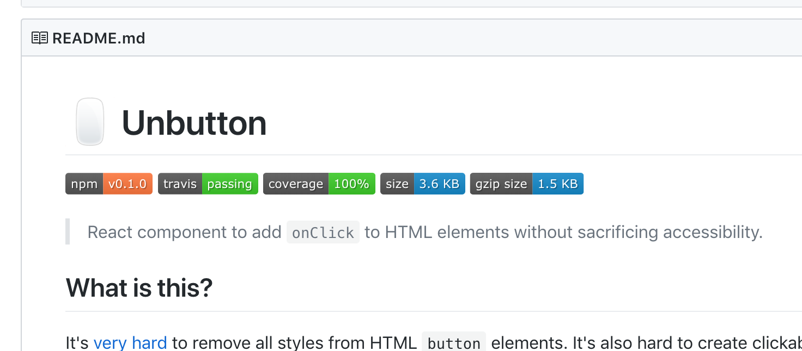

[](https://github.com/danoc/unbutton)

It bothers me that there's no easy way to remove styles from a button element or properly add `onClick` to a `div`. This encourages developers to take shortcuts and hurts users navigating the web with keyboard and screen readers.

Inspired by my own frustrations, a [tweet by Micah Godbolt](https://twitter.com/micahgodbolt/status/1047218367432544257), and a follow-up [blog post by Scott O'Hara](https://www.scottohara.me/blog/2018/10/03/unbutton-buttons.html), I've created a React component called [Unbutton](https://github.com/danoc/unbutton).

[Unbutton](https://github.com/danoc/unbutton) makes it easy to add `onClick` to arbitrary HTML elements without sacrificing accessibility.

You can install it with NPM:

```
npm install unbutton
```

And use it like this:

```jsx
// import Unbutton from 'unbutton';

<Unbutton
  onClick={this.closeModal}
  aria-label="Close modal"
  className="icon-button"
>
  <CloseIcon />
</Unbutton>
```

This will render a `span` that is accessible for users navigating by screen readers, keyboard, and mouse/touch.

Take a look at [Unbutton on GitHub](https://github.com/danoc/unbutton) to learn more, send feedback, or ask questions.
