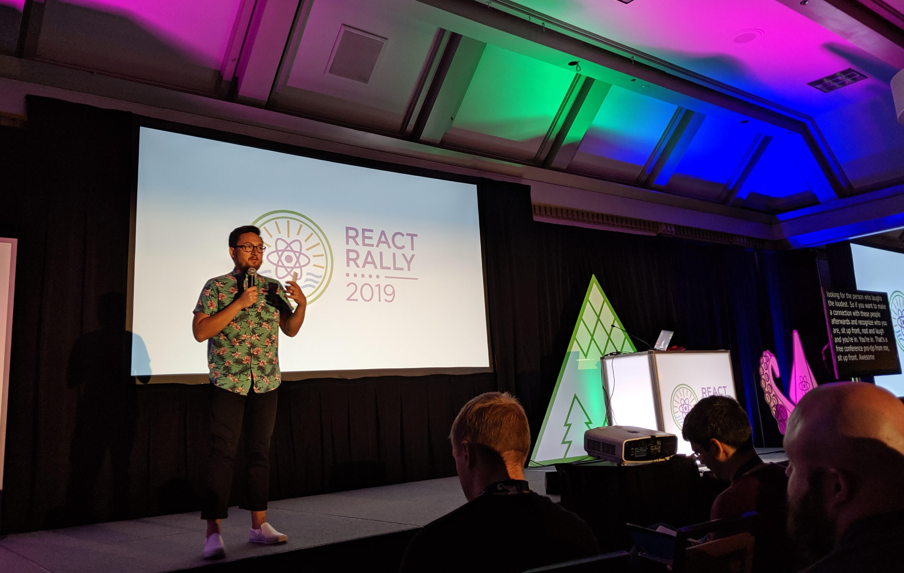

I was recently at [React Rally](https://www.reactrally.com/), a two-day conference about React in Salt Lake City. This post is a collection of the notes I took.

Since [all the talks are on YouTube](https://www.youtube.com/playlist?list=PLUD4kD-wL_zaXhR4KU1CkUSIzh1TrvnzA), I recommend using these notes to help discover which talks you’d like to watch. I’ve also included links to the slides and more notes, when available.

---

## Table of contents

- [Chrome ❤️ React](#chrome-%EF%B8%8F-react)
- [Frontend Application Bundles: the Docker of Frontend](#frontend-application-bundles-the-docker-of-frontend)
- [Off Balance -- Interactive Storytelling with React](#off-balance--interactive-storytelling-with-react)
- [Is React Translated Yet?](#is-react-translated-yet)
- [Saving the Web, 16ms at a Time](#saving-the-web-16ms-at-a-time)
- [Helping Governments And Nonprofits With Our Coding Superpower](#helping-governments-and-nonprofits-with-our-coding-superpower)
- [Battle for the DOM: D3 vs React](#battle-for-the-dom-d3-vs-react)
- [A11y And React, Why Is It Important?](#a11y-and-react-why-is-it-important)
- [Creating Awesome UX with Observables](#creating-awesome-ux-with-observables)
- [So You Think YOU'RE a Junior Dev?](#so-you-think-youre-a-junior-dev)
- [Horrible Interfaces and How to Build Them](#horrible-interfaces-and-how-to-build-them)
- [The Universe in a Single Arrow: A Live Dive into the Lambda Calculus](#the-universe-in-a-single-arrow-a-live-dive-into-the-lambda-calculus)
- [All The Memory Safety Of C Combined With All The Blazing Speed Of JavaScript](#all-the-memory-safety-of-c-combined-with-all-the-blazing-speed-of-javascript)
- [Debugging the Debugger](#debugging-the-debugger)
- [Write Fewer Tests! From Automation to Autogeneration](#write-fewer-tests-from-automation-to-autogeneration)
- [Harnessing React to Build Consistently Designed Applications](#harnessing-react-to-build-consistently-designed-applications)
- [React Hooks Pitfalls](#react-hooks-pitfalls)
- [Code is a User Interface](#code-is-a-user-interface)
- [Follow the (full)stack trace: understand your app with distributed tracing](#follow-the-fullstack-trace-understand-your-app-with-distributed-tracing)
- [Weaving Tapestries of Code](#weaving-tapestries-of-code)
- [Human React](#human-react)

---

## Notes

### Chrome ❤️ React

By [Nicole Sullivan](https://twitter.com/stubbornella) - [More notes](https://www.reddit.com/r/reactjs/comments/ctypzk/react_rally_megathread_day_1/exp6g8s?utm_source=share&utm_medium=web2x)

<iframe width="560" height="315" src="https://www.youtube.com/embed/XD8UQeYm5Vk" frameborder="0" allow="accelerometer; autoplay; encrypted-media; gyroscope; picture-in-picture" allowfullscreen loading="lazy"></iframe>

- The Chrome team hired Nicole as a product manager to work with frameworks.
- "We're on the brink of a performance revolution" that is "led by frameworks" and "inspired by powerful, battle-tested internal tools and technology."
- Her team saw a ~16% improvement in median time to interactive (TTI) on sites that use frameworks (React, Vue, etc.) with a "meta-framework" (Next.js, Nuxt, Gatsby, etc.)
- Chrome has an entire team contributing code to frameworks like React and Next.js. When they contribute to Next.js, they try to make the change in a way that others can also benefit. Instead of submitting a PR to Next.js, for example, they'd rather submit a PR to Webpack.
- They've been collaborating with the React team on a [main-thread scheduling API for JavaScript](https://github.com/WICG/main-thread-scheduling). The API shipped last week. This [Scheduling in React](https://philippspiess.com/scheduling-in-react/) article explains why this is helpful.
- They recently [merged a PR in Next.js](https://github.com/zeit/next.js/pull/7961) that allows modern browsers to load a smaller JavaScript bundle, leading to a 21% reduction in bundle size.
- An example of a PR they made to Next.js: [https://github.com/zeit/next.js/pull/7961](https://github.com/zeit/next.js/pull/7961)
- Chrome has a \$200,000 fund to [support open-source projects](https://opencollective.com/chrome) that tackle performance on the web.

### Frontend Application Bundles: the Docker of Frontend

By [Glen Maddern](https://twitter.com/glenmaddern) - [More notes](https://www.reddit.com/r/reactjs/comments/ctypzk/react_rally_megathread_day_1/expavci?utm_source=share&utm_medium=web2x)

<iframe width="560" height="315" src="https://www.youtube.com/embed/9WaqB90kWwc" frameborder="0" allow="accelerometer; autoplay; encrypted-media; gyroscope; picture-in-picture" allowfullscreen loading="lazy"></iframe>

- Glen has been working on [fab.dev](https://fab.dev/), a tool that seeks to do to front-end what Docker did to infrastructure.
- He started the talk with a brief story of [how the shipping container completely transformed commerce](https://www.npr.org/sections/money/2015/08/19/432909854/episode-500-the-humble-innovation-at-the-heart-of-the-global-economy).
- FAB (Frontend Application Bundle) bundles code from Create React App, Next.js, Gatsby, and other "meta-frameworks" into a format that can be deployed on AWS Lambda, Cloudflare Workers, Now, and other services.
- Believes that the React team's current work on server-side rendering improvements will greatly change performance in React applications. He recommended [Andrew Clark's talk at Zeit Day](https://www.youtube.com/watch?v=z-6JC0_cOns).
- He prefers Next.js over Gatsby because you [ship static and dynamic server-rendered pages pages](https://nextjs.org/blog/next-9#automatic-static-optimization). Gatsby is only static.
- He is also very impressed by [Clouldlare Workers](https://www.cloudflare.com/products/cloudflare-workers/), a platform that allows developers to build serverless applications that get deployed to Cloudflare's data centers in 193 cities.

### Off Balance -- Interactive Storytelling with React

By [Mihai Cernusca](https://twitter.com/mcernusca) - [Slides](http://mihaicernusca.com/off-balance) - [More notes](https://www.reddit.com/r/reactjs/comments/ctypzk/react_rally_megathread_day_1/expm7wv?utm_source=share&utm_medium=web2x)

<iframe width="560" height="315" src="https://www.youtube.com/embed/CqQX_pIAJug" frameborder="0" allow="accelerometer; autoplay; encrypted-media; gyroscope; picture-in-picture" allowfullscreen loading="lazy"></iframe>

- Mihai is a storyteller on the web. He creates animation heavy interfaces such as [America Off Balance](https://americaoffbalance.org/).
- His talk covered "shape generation, orchestration and dynamic interpolation strategies to bring a design to life." He covered "performance considerations and lessons learned" through examples of the project he's worked on.

### Is React Translated Yet?

By [Nat Alison](https://twitter.com/tesseralis) - [More notes](https://www.reddit.com/r/reactjs/comments/ctypzk/react_rally_megathread_day_1/exprj6e/)

<iframe width="560" height="315" src="https://www.youtube.com/embed/V9PW4HeZyBw" frameborder="0" allow="accelerometer; autoplay; encrypted-media; gyroscope; picture-in-picture" allowfullscreen loading="lazy"></iframe>

- The Facebook team hired her to work on the translation of [reactjs.org](https://reactjs.org/).
- 80% of the world doesn't speak English.
- Some lessons she learned:
  - If you don't make officially translated documentation, folks will make unofficial clones. While the enthusiasm is great, these docs will likely get stale and the translations may be inaccurate.
  - She started the project by focusing on three languages. This allowed her to find issues early and fix them before scaling to 45 languages.
  - She borrowed some ideas from the Vue translation efforts and created GitHub bots to automate much of the work.
  - Each language has a team of maintainers. She gave them as much ownership as possible to work as they find effective.
- She created the website [isreacttranslatedyet.com](https://isreacttranslatedyet.com/) to encourage volunteers and share progress. The site celebrates all the work that has been done.

### Saving the Web, 16ms at a Time

By [Josh Comeau](https://twitter.com/JoshWComeau) - [Slides](https://github.com/joshwcomeau/talk-2019) - [More notes](https://www.reddit.com/r/reactjs/comments/ctypzk/react_rally_megathread_day_1/expx3lr?utm_source=share&utm_medium=web2x)

<iframe width="560" height="315" src="https://www.youtube.com/embed/DNGGzwmfouU" frameborder="0" allow="accelerometer; autoplay; encrypted-media; gyroscope; picture-in-picture" allowfullscreen loading="lazy"></iframe>

- Examples of how input latency can ruin the user experience:
  - <https://input-delay.glitch.me/>
  - <https://www.hillelwayne.com/post/performance-matters/>
- Animation is important for the web to remain relevant in a native-first world. These animations must be smooth.
- Referenced the "[Rendering Performance](https://developers.google.com/web/fundamentals/performance/rendering/)" post by Paul Lewis.
- Performance improvements don't need to be fancy. He made a demo of Twitter's "like" button and found that [using a sprite sheet](https://github.com/joshwcomeau/talk-2019/blob/master/assets/like-sprite-60.png) was much faster than [animating an SVG](https://github.com/joshwcomeau/talk-2019/tree/master/src/components/LikeButton).

### Helping Governments And Nonprofits With Our Coding Superpower

By [Joel Denning](https://twitter.com/joelbdenning) - [More notes](https://www.reddit.com/r/reactjs/comments/ctypzk/react_rally_megathread_day_1/exqnomc?utm_source=share&utm_medium=web2x)

<iframe width="560" height="315" src="https://www.youtube.com/embed/Si0is6GkB64" frameborder="0" allow="accelerometer; autoplay; encrypted-media; gyroscope; picture-in-picture" allowfullscreen loading="lazy"></iframe>

- In life, it's easy to get caught up in getting attention and not enough in paying attention.
- He decided to help non-profits. Sent a cold-email to [Comunidades Unidas](https://www.cuutah.org/) and is now building them a CRM to track their work.
- He and his team have worked on a handful of other initiatives such as [OpenMRS](https://openmrs.org/) and [Utah Expungements](https://utahexpungements.org/).
- Gave tips on how to get involved in these types of projects. You don't have to quit your job. It's possible to start small and have a large impact.

### Battle for the DOM: D3 vs React

By [Danielle Carrick](https://twitter.com/DanieC) - [Slides](https://docs.google.com/presentation/d/1sALpsJtuQMHHjH55IOOffjAgdSFBigc8ukfkaM4BBKs/edit)

<iframe width="560" height="315" src="https://www.youtube.com/embed/S3YOcZ0F9vQ" frameborder="0" allow="accelerometer; autoplay; encrypted-media; gyroscope; picture-in-picture" allowfullscreen loading="lazy"></iframe>

- Using D3 with React is not obvious because both want control over the DOM.
- One way to make it work is to give D3 a div within React and allow it to use that for rendering. The other is to let React handle all the DOM and to use D3 only for the utility functions that it provides. The [latter approach is much faster](https://docs.google.com/presentation/d/1sALpsJtuQMHHjH55IOOffjAgdSFBigc8ukfkaM4BBKs/edit#slide=id.g5dc20df902_0_4).
- She talked about her work on her projects for Wired, Teen Vogue, and The New Yorker.

### A11y And React, Why Is It Important?

By [Johnny Bell](https://twitter.com/johnnyxbell) - [Slides](https://a11y.johnnybell.io/) - [More notes](https://www.reddit.com/r/reactjs/comments/ctypzk/react_rally_megathread_day_1/exr57qt?utm_source=share&utm_medium=web2x)

<iframe width="560" height="315" src="https://www.youtube.com/embed/_756Hsawbv4" frameborder="0" allow="accelerometer; autoplay; encrypted-media; gyroscope; picture-in-picture" allowfullscreen loading="lazy"></iframe>

- Johnny is a developer at [StackShare](https://stackshare.io/) and runs [Devs With Disabilities](https://dwd.dev/). He was born without his left arm.
- We've agreed as a society that the real world must be accessible. There are wheelchair ramps, handicapped bathrooms, priority seating, and much more. Why don't we have standards in the digital world?
- He went through two examples of filling out a form field. The first was without using a mouse. The second was with a screen-reader. Many times it's not even possible to use the site.
- If you want to audit the accessibility on your site, he recommends using Google's [Lighthouse](https://developers.google.com/web/tools/lighthouse/) tool and the ESLint plugin [eslint-plugin-jsx-a11y](https://www.npmjs.com/package/eslint-plugin-jsx-a11y).

### Creating Awesome UX with Observables

By [Feather Knee](https://twitter.com/featherart) - [Slides](https://github.com/featherart/slides) - [More notes](https://www.reddit.com/r/reactjs/comments/ctypzk/react_rally_megathread_day_1/exr5iet?utm_source=share&utm_medium=web2x)

<iframe width="560" height="315" src="https://www.youtube.com/embed/9OlUwSZyAww" frameborder="0" allow="accelerometer; autoplay; encrypted-media; gyroscope; picture-in-picture" allowfullscreen loading="lazy"></iframe>

- Explained Observables at a high level, gave examples of uses cases, then dove into implementations.
- [RXJS](https://rxjs.dev/guide/overview) is a "is a library for composing asynchronous and event-based programs by using observable sequences." It's "like Lodash for events."
- (I didn't take good notes for this one. I recommend reading through [@swyx's more detailed notes](https://www.reddit.com/r/reactjs/comments/ctypzk/react_rally_megathread_day_1/exr5iet/?utm_source=share&utm_medium=web2x) instead.)

### So You Think YOU'RE a Junior Dev?

By [Revel Carlberg West](https://twitter.com/revelcw)

<iframe width="560" height="315" src="https://www.youtube.com/embed/SCUIEQryBZ8" frameborder="0" allow="accelerometer; autoplay; encrypted-media; gyroscope; picture-in-picture" allowfullscreen loading="lazy"></iframe>

- Revel is a 10 year old developer.
- This was his second time speaking about React. The [first was at React NYC](https://www.youtube.com/watch?v=mbiryVTIJ4Q) when he was 9 years old.
- He gave an impressive live demo of React Hooks.

### Horrible Interfaces and How to Build Them

By [Anthony Frehner](https://twitter.com/aahfrena) - [Examples](https://codepen.io/collection/nvmBQV/)

<iframe width="560" height="315" src="https://www.youtube.com/embed/RgqSlRbbvwA" frameborder="0" allow="accelerometer; autoplay; encrypted-media; gyroscope; picture-in-picture" allowfullscreen loading="lazy"></iframe>

- Anthony, inspired by an [Imgur gallery called "Input fields from hell"](https://imgur.com/gallery/lOSqKa1), built [five examples](https://codepen.io/collection/nvmBQV/#) of horrible interfaces for changing the volume of music.
- The talk covers CSS transforms, Audio & MediaStream APIs, and the Drag and Drop API. Anthony shares what he learned along the way.

### The Universe in a Single Arrow: A Live Dive into the Lambda Calculus

By [Anjana Vakil](https://twitter.com/anjanavakil) - [Slides](https://gist.github.com/vakila/e920ba4d5567ddbb1c0e64f17366c77f) - [More notes](https://www.reddit.com/r/reactjs/comments/cuf5es/react_rally_megathread_day_2/extrss0?utm_source=share&utm_medium=web2x)

<iframe width="560" height="315" src="https://www.youtube.com/embed/1QY7P_yXc_M" frameborder="0" allow="accelerometer; autoplay; encrypted-media; gyroscope; picture-in-picture" allowfullscreen loading="lazy"></iframe>

- A lambda (λ) function is anonymous, pure, and little.
- Anjana gives an overview of lambda calculus by writing functions in JavaScript. In the talk she creates functions that can count, add, and multiply. She also covers booleans, conditionals, and more.

### All The Memory Safety Of C Combined With All The Blazing Speed Of JavaScript

By [Sarah Lim](https://twitter.com/soylentqueen) - [Slides](http://sarahlim.com/react-rally-2019/) - [More notes](https://www.reddit.com/r/reactjs/comments/cuf5es/react_rally_megathread_day_2/extuyoc?utm_source=share&utm_medium=web2x)

<iframe width="560" height="315" src="https://www.youtube.com/embed/NtTybfTlj58" frameborder="0" allow="accelerometer; autoplay; encrypted-media; gyroscope; picture-in-picture" allowfullscreen loading="lazy"></iframe>

- WebAssembly (Wasm) is a "binary instruction format for a stack-based virtual machine." It compiles high-level languages (like C/C++/Rust) into code that can run on the web in a server or client.
- Wasm matters because we need a performant runtime for the web.
- Wasm modules provide both type safety and memory safety. They are sandboxed so that memory security issues are not a concern. There's no way for one module to affect another.
- The "[WebAssembly Explorer](https://mbebenita.github.io/WasmExplorer/)" lets you write C++ and see how it gets compiled into a .wat file. You can also assemble the file and see the output as Firefox x86 Assembly.
- Wrote a [neat tool to trace the execution of Wasm code](https://github.com/sarahlim/wasm-trace).

### Debugging the Debugger

By [Princiya Sequeira](https://twitter.com/princi_ya) - [Slides](https://docs.google.com/presentation/d/13vI7KepXN2Zm-mHm3mfYh7hGrYg1r_XFFUXWSPNjj8s/edit)

<iframe width="560" height="315" src="https://www.youtube.com/embed/QklMZaObKY4" frameborder="0" allow="accelerometer; autoplay; encrypted-media; gyroscope; picture-in-picture" allowfullscreen loading="lazy"></iframe>

- [Grace Hopper](https://en.wikipedia.org/wiki/Grace_Hopper) coined the term debug. It is called "debug" because there was a literal bug in the computer.
- [Elizabeth Holberton](https://en.wikipedia.org/wiki/Betty_Holberton) invented the breakpoint.
- In her talk, Princiya gives tips on how to effectively use the Firefox debugger. This includes setting a breakpoint, adding conditional logging, debug worker threads, working with sourcemaps, adding conditional breakpoints.
- Princiya also shows how she debugs the debugger in Firefox. She is an active contributor to [firefox-devtools/debugger](https://github.com/firefox-devtools/debugger).
- Firefox will soon have "[Time Travel Debugging](https://gist.github.com/jasonLaster/1e220992c294a571dd9b59abd084ccf2)," providing developers the ability to record the execution of a web page. Developers can then rewind the execution to assist with debugging.

### Write Fewer Tests! From Automation to Autogeneration

By [David Khourshid](https://twitter.com/DavidKPiano) - [Slides](https://slides.com/davidkhourshid/mbt) - [More notes](https://www.reddit.com/r/reactjs/comments/cuf5es/react_rally_megathread_day_2/exuar0x?utm_source=share&utm_medium=web2x)

<iframe width="560" height="315" src="https://www.youtube.com/embed/tpNmPKjPSFQ" frameborder="0" allow="accelerometer; autoplay; encrypted-media; gyroscope; picture-in-picture" allowfullscreen loading="lazy"></iframe>

- As product requirements grow, the amount of code grows, and the amount of tests grow even more.
- Outside the tech industry, tests are not written by the person that wrote the source.
- (This talk is a follow-up to a talk called "[Infinitely Better UIs with Finite Automata](https://www.youtube.com/watch?v=VU1NKX6Qkxc)" that David gave at the 2017 React Rally. If this one sounds interesting, I'd recommend watching that one first.)
- David shows how we can use "[Model-based testing](https://en.wikipedia.org/wiki/Model-based_testing)" in JavaScript. If we define our model upfront with state machines, we can easily autogenerate tests for our application.
- This works for unit tests and E2E tests.
- David recently launched [@xstate/test](https://github.com/davidkpiano/xstate/tree/master/packages/xstate-test), a tool that facilitates model-based testing. He gave a demo of it.

### Harnessing React to Build Consistently Designed Applications

By Emily Plummer - [Slides](https://docs.google.com/presentation/d/1ku4BysY6k1bCgZEp0Qp42ihIRixBsKSvHnOPzs4kUM4/edit) - [More notes](https://www.reddit.com/r/reactjs/comments/cuf5es/react_rally_megathread_day_2/exudnav?utm_source=share&utm_medium=web2x)

<iframe width="560" height="315" src="https://www.youtube.com/embed/Ef7lkrRlp3w" frameborder="0" allow="accelerometer; autoplay; encrypted-media; gyroscope; picture-in-picture" allowfullscreen loading="lazy"></iframe>

- Emily builds [Primer](https://primer.style/), the design system at GitHub.
- Her team has defined a [set of principles](https://github.com/primer/components/blob/master/principles.md) that they follow when building components.
- They use [styled-system](https://github.com/styled-system/styled-system) to build their components.
- They enjoy working in the open on [GitHub](https://github.com/primer), [Spectrum](https://spectrum.chat/primer), and [Twitter](https://twitter.com/githubprimer).
- (I mostly listened to this one and didn't take too many notes.)

### React Hooks Pitfalls

By [Kent C. Dodds](https://twitter.com/kentcdodds) - [Slides and examples](https://github.com/kentcdodds/react-hooks-pitfalls) - [More notes](https://www.reddit.com/r/reactjs/comments/cuf5es/react_rally_megathread_day_2/exv1heh?utm_source=share&utm_medium=web2x)

<iframe width="560" height="315" src="https://www.youtube.com/embed/VIRcX2X7EUk" frameborder="0" allow="accelerometer; autoplay; encrypted-media; gyroscope; picture-in-picture" allowfullscreen loading="lazy"></iframe>

- (This talk is adapted from [Kent's "5 Tips to Help You Avoid React Hooks Pitfalls" blog post](https://www.notion.so/Notes-from-React-Rally-2019-d49b38a24750431291973c946edcb984). I recommend reading it if this seems interesting.)
- The five common React Hooks pitfalls:
  - Starting without a good foundation: [Read the docs](https://reactjs.org/docs/hooks-intro.html).
  - Not using (or ignoring) [the ESLint plugin](https://www.npmjs.com/package/eslint-plugin-react-hooks)
  - Thinking in Lifecycles: Our previous experience with lifecycles can make it more difficult to grasp how hooks work.
  - Overthinking performance: "Know that React is fast by default and do some digging before applying performance optimizations pre-maturely"
  - Overthinking the testing of hooks: You may need to re-write tests that used Enzyme's .state function. This refactor is a good thing because you should avoid testing implementation details.

### Code is a User Interface

By [Justin Falcone](https://twitter.com/modernserf)

<iframe width="560" height="315" src="https://www.youtube.com/embed/UzZQJH_EZmA" frameborder="0" allow="accelerometer; autoplay; encrypted-media; gyroscope; picture-in-picture" allowfullscreen loading="lazy"></iframe>

- Built [Zebu](https://github.com/modernserf/zebu), a JavaScript library for building little languages with tagged template literals.
- (I didn't take good notes for this one. Sorry!)

### Follow the (full)stack trace: understand your app with distributed tracing

By [Will Klein](https://twitter.com/WillsLab)

<iframe width="560" height="315" src="https://www.youtube.com/embed/_fICKWXfkKo" frameborder="0" allow="accelerometer; autoplay; encrypted-media; gyroscope; picture-in-picture" allowfullscreen loading="lazy"></iframe>

- How do we inspect what's going on in our app when a request happens? We can look at console log's, the network tab in DevTools, server logs, and much more.
- Distributed tracing allows you to get a high-level view of performance across all your services. It's mostly seen as a tool for backend engineers---not something that is used in the frontend. In his talk, WIll shows how you can use middleware to achieve a "(full)stack track" that connects the frontend and backend.

### Weaving Tapestries of Code

By [Jen Luker](https://twitter.com/knitcodemonkey) - [Slides](https://jenluker.com/weaving-tapestries-of-code/assets/player/KeynoteDHTMLPlayer.html#0)

<iframe width="560" height="315" src="https://www.youtube.com/embed/M5tyaBBqKIw" frameborder="0" allow="accelerometer; autoplay; encrypted-media; gyroscope; picture-in-picture" allowfullscreen loading="lazy"></iframe>

- Jen gives walks us through the history of the textile industry.
  - She shows how advancements in textile technology led to the birth of computing.
  - All of the advancements in the textile and computing industry were built on top of the work of others. "Just because your work is built on top of other people's work doesn't mean it's amazing."
- Knitting is used as a tool to teach programming to folks that don't have access to a computer.

### Human React

By [Brian Holt](https://twitter.com/holtbt) - [Slides](https://speakerdeck.com/btholt/human-react)

<iframe width="560" height="315" src="https://www.youtube.com/embed/sZPxFKRTW94" frameborder="0" allow="accelerometer; autoplay; encrypted-media; gyroscope; picture-in-picture" allowfullscreen loading="lazy"></iframe>

- We choose frameworks partly because of the community.
- As developers, ensuring that our UIs are accessible is a good way to [lend our privilege](https://anjuansimmons.com/talks/lending-privilege/).
- "When should you refactor your app to use Hooks? After you fix your accessibility!" It's easy to forget our users and get caught up in the latest and greatest technologies.
- Brian gives a plea to thoughtfully learn from others in other communities, welcome all into the React community, avoid tribalism, and lift each other up.
